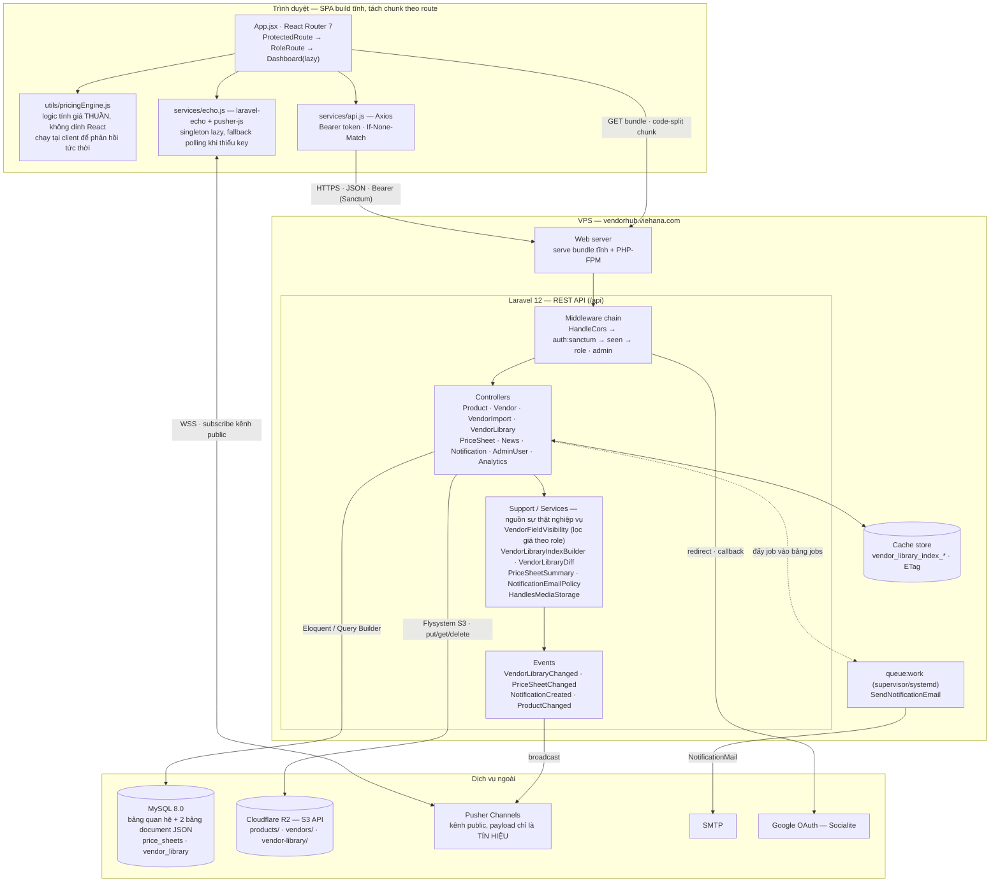
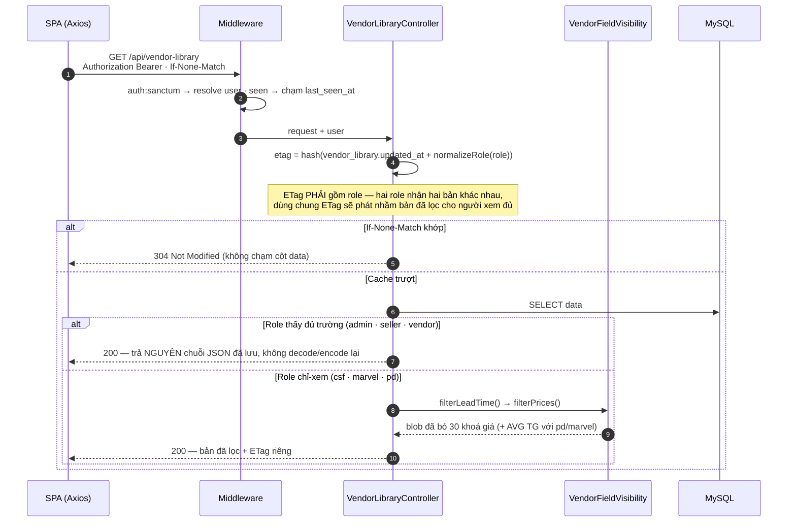
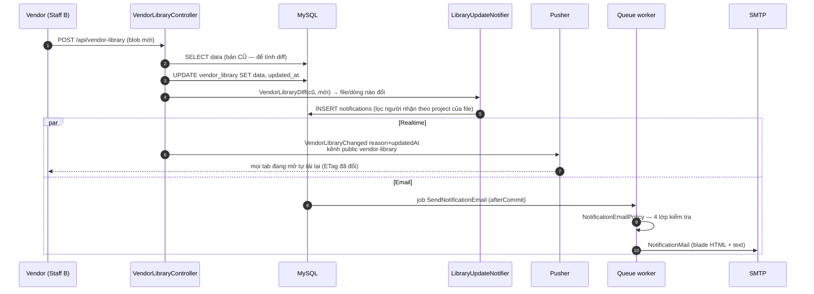
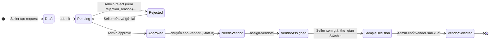
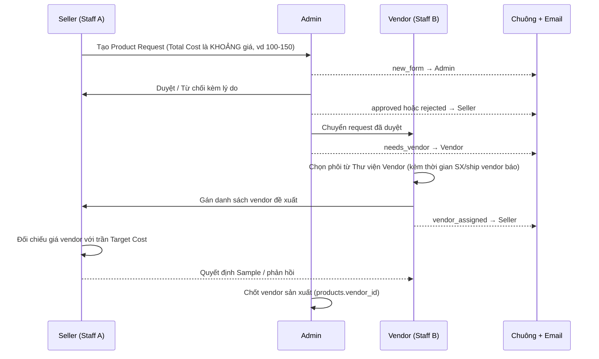
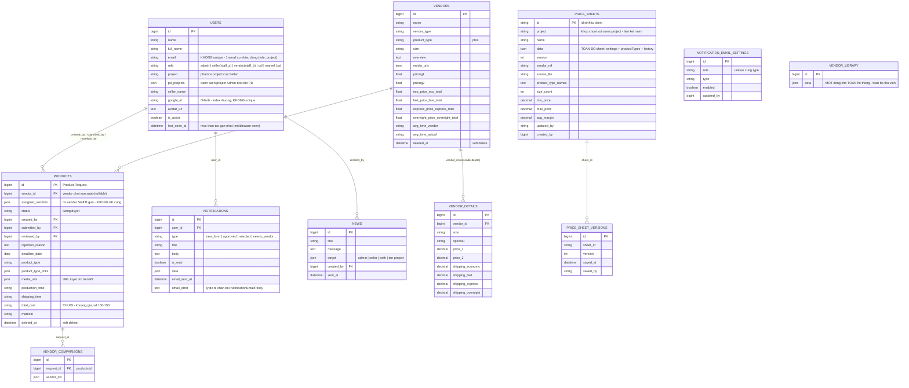

# HappyC-Hub Vendor Management

Hệ thống nội bộ số hoá quy trình **quản lý nhà cung cấp (Vendor)**, **thẩm định giá sản phẩm** và **duyệt Product Request** cho Happy Creative.

| | |
|---|---|
| **Production** | [vendorhub.viehana.com](https://vendorhub.viehana.com) |
| **Frontend** | React 19 · Vite 6 · React Router 7 (SPA, build tĩnh) |
| **Backend** | Laravel 12 · PHP 8.2+ · REST API |
| **Datastore** | MySQL 8.0 · Cloudflare R2 (media) |
| **Realtime** | Pusher Channels (Laravel Echo) |
| **Vai trò** | Admin · Seller (Staff A) · Vendor (Staff B) · CSF · Marvel · PD |

---

## Mục lục

1. [Bối cảnh & phạm vi](#1-bối-cảnh--phạm-vi)
2. [Kiến trúc hệ thống](#2-kiến-trúc-hệ-thống)
3. [Vai trò & mô hình phân quyền](#3-vai-trò--mô-hình-phân-quyền)
4. [Luồng nghiệp vụ](#4-luồng-nghiệp-vụ)
5. [Module chức năng](#5-module-chức-năng)
6. [Pricing Engine](#6-pricing-engine)
7. [Mô hình dữ liệu](#7-mô-hình-dữ-liệu)
8. [API Reference](#8-api-reference)
9. [Realtime & thông báo](#9-realtime--thông-báo)
10. [Lưu trữ media trên Cloudflare R2](#10-lưu-trữ-media-trên-cloudflare-r2)
11. [Cấu hình môi trường](#11-cấu-hình-môi-trường)
12. [Cài đặt & chạy local](#12-cài-đặt--chạy-local)
13. [Kiểm thử](#13-kiểm-thử)

---

## 1. Bối cảnh & phạm vi

### 1.1. Bài toán

Trước khi chốt đơn vị sản xuất cho một sản phẩm, nhiều phòng ban phải trao đổi qua lại: Seller đề xuất sản phẩm, Admin duyệt, Vendor (Operations) tìm và đề xuất nhà cung cấp, Seller thẩm định cấu trúc giá. Quy trình này từng chạy rời rạc trên Excel và Google Sheet.

| Vấn đề | Cách hệ thống giải quyết |
|---|---|
| Dữ liệu vendor phân mảnh, mỗi người một bản Excel | **Thư viện Vendor** tập trung trong DB, import trực tiếp từ file Excel chuẩn Happy Creative |
| Công thức tính giá bán làm tay trên Google Sheet, dễ sai | **Pricing Engine** số hoá toàn bộ công thức, dùng chung cho workspace, danh sách bảng giá và export Excel |
| Không rõ ai đang chờ ai duyệt | Luồng **Request → Duyệt → Cung cấp Vendor → Quyết định Sample** rõ ràng theo vai trò, kèm chuông + email |
| Lộ giá cho bộ phận không phận sự | Vai trò chỉ-xem (**CSF / Marvel / PD**) bị **lọc trường giá ngay tại server**, không phải ẩn cột ở UI |
| Tra cứu chậm | Modal chi tiết hiển thị ảnh, chất liệu, thời gian SX/ship, size; mỗi file thư viện có **permalink** chia sẻ được |
| Nhiều thiết bị xem số liệu lệch nhau | Trạng thái nghiệp vụ (Best Seller, Sample, News, Price Sheet) lưu ở DB và **đẩy realtime** qua Pusher |

### 1.2. Ngoài phạm vi

Các bảng `customers`, `orders`, `order_items`, `payments`, `inventory_logs` còn lại từ scaffold ban đầu và **không tham gia** luồng nghiệp vụ hiện tại.

---

## 2. Kiến trúc hệ thống

### 2.1. Sơ đồ thành phần & triển khai



**Nguyên tắc kiến trúc:**

| Nguyên tắc | Hệ quả trong code |
|---|---|
| **Server là nơi thực thi phân quyền** | Trường giá bị `unset` khỏi response trước khi rời server ([`VendorFieldVisibility`](backend/app/Support/VendorFieldVisibility.php)); UI chỉ dựng cột theo bản song sinh [`vendorFieldVisibility.js`](frontend/src/constants/vendorFieldVisibility.js) |
| **Payload realtime chỉ mang tín hiệu** | Kênh Pusher là public — event chỉ chứa id/mốc thời gian, client phải gọi lại API có token để lấy dữ liệu thật |
| **Tính giá chạy phía client** | Seller chỉnh số thấy kết quả ngay, không round-trip; cùng công thức được port sang [`PriceSheetSummary.php`](backend/app/Support/PriceSheetSummary.php) cho số liệu tổng hợp ở danh sách |
| **Một quy tắc — một chỗ khai báo** | Danh sách project ([`projects.js`](frontend/src/constants/projects.js)), mục dashboard ([`dashboardSections.js`](frontend/src/constants/dashboardSections.js)), loại email ([`notification_mail.php`](backend/config/notification_mail.php)) |
| **Dữ liệu khởi tạo seed trong migration** | Production deploy bằng `git pull` + `php artisan migrate`, **không** chạy `db:seed` |

### 2.2. Vòng đời một request đọc (có cache)

`GET /api/vendor-library` là đường vào nặng nhất của hệ thống — blob thư viện là **một dòng longText cho toàn hệ thống**. Cơ chế đầy đủ:



### 2.3. Vòng đời một request ghi (fan-out)



### 2.4. Phân lớp backend

```
routes/api.php
  └─ Middleware        HandleCors · auth:sanctum · seen · role:… · admin
      └─ Controller    nhận/validate request, quyết định HTTP status, ETag
          └─ Support   quy tắc nghiệp vụ thuần (phân quyền trường, diff, summary)
              └─ Model Eloquent (Product · Vendor · User · Notification · News)
                  └─ MySQL / Cloudflare R2
```

Alias middleware khai ở [`bootstrap/app.php`](backend/bootstrap/app.php):

| Alias | Lớp | Vai trò |
|---|---|---|
| `admin` | `AdminMiddleware` | chỉ role `admin` |
| `role:a,b` | `RoleMiddleware` | danh sách role cho phép (chuẩn hoá bỏ `_`/`-`/space) |
| `seen` | `TouchLastSeen` | ghi `users.last_seen_at`; **chỉ dùng sau** `auth:sanctum` |

### 2.5. Cấu trúc thư mục

```
/
├── backend/                          Laravel 12 API
│   ├── app/Http/Controllers/         Product · Vendor · Auth · SocialAuth · AdminUser · Analytics · Notification
│   │   └── Api/                      VendorLibrary · VendorImport · PriceSheet · News
│   ├── app/Http/Middleware/          AdminMiddleware · RoleMiddleware · TouchLastSeen
│   ├── app/Models/                   User · Product · Vendor · Notification · News · NotificationEmailSetting
│   ├── app/Support/                  VendorFieldVisibility · VendorLibraryIndexBuilder · VendorLibraryDiff
│   │                                 PriceSheetSummary · HandlesMediaStorage · SnapshotTime
│   ├── app/Services/                 NotificationService · NotificationEmailPolicy · LibraryUpdateNotifier
│   ├── app/Events/                   VendorLibraryChanged · PriceSheetChanged · NotificationCreated · ProductChanged
│   ├── app/Console/Commands/         MigrateMediaToObjectStorage · AuditMediaStorage · Backfill*
│   ├── config/                       filesystems · broadcasting · notification_mail
│   ├── database/migrations/          69 migration (seed dữ liệu khởi tạo ngay trong migration)
│   └── routes/api.php                Toàn bộ endpoint
├── frontend/                         React 19 + Vite 6
│   ├── src/pages/                    Login · AuthCallback · {Admin,Seller,Vendor,Csf,Pd}Dashboard
│   │                                 PriceSheetPage · LibraryFilePage
│   ├── src/components/               admin/ · seller/ · vendor/ · csfpd/ · library/ · shared/
│   ├── src/routes/                   ProtectedRoute · RoleRoute
│   ├── src/utils/                    pricingEngine · resolveSheet · vendorLibraryIndex
│   │                                 vendorExcel · productExcel · sheetExport · targetCost …
│   ├── src/constants/                projects · dashboardSections · sellerTheme · vendorFieldVisibility
│   ├── src/services/                 api.js (Axios) · echo.js (Pusher)
│   └── src/hooks/                    useApi · usePagination · useSectionRoute · useResizablePane · useIsMobile
├── docs/MEDIA_R2_CUTOVER.md          Runbook cutover media sang R2
├── .github/workflows/                tests.yml · frontend-build-check.yml
└── docker-compose.yml                MySQL 8.0 + phpMyAdmin (dev local)
```

### 2.6. Quy ước frontend

- **Design System nội bộ** — màu/shadow/bo góc khai ở [`src/constants/sellerTheme.js`](frontend/src/constants/sellerTheme.js) (`HC.orange`, `HC.surface`…). Component chính tự code bằng `<div style={{…}}>` inline để kiểm soát hoàn toàn giao diện; Ant Design chỉ dùng cho khung layout/icon của dashboard chỉ-xem, Chart.js cho biểu đồ.
- **URL là nguồn sự thật cho mục đang mở** — mỗi tab dashboard có slug riêng (`/seller/price-sheets`, `/vendor/library`…) qua `useSectionRoute`, nên bookmark / F5 / nút Back đều đúng mục.
- **Tách bundle theo route** — mọi dashboard đều `lazy()`; chỉ `Login` giữ import tĩnh vì là màn hình đầu của mọi phiên.
- **Overlay giữ ngữ cảnh** — mở một file thư viện từ danh sách đổi URL sang `/library/:fileId` nhưng `Routes` khớp theo *location nền* lưu trong `location.state`, nên dashboard phía sau không unmount và không mất vị trí cuộn.

---

## 3. Vai trò & mô hình phân quyền

### 3.1. Sáu vai trò

| Vai trò | Dashboard | Nhiệm vụ |
|---|---|---|
| **Admin** | `/admin` | Duyệt/từ chối Product Request, chốt vendor sản xuất, quản lý nhân sự & phân quyền, xem toàn bộ dữ liệu mọi project |
| **Seller** *(tên cũ: Staff A)* | `/seller` | Tạo Product Request, xem vendor được đề xuất, ra quyết định Sample, **lập bảng tính giá bán** |
| **Vendor** *(tên cũ: Staff B)* | `/vendor` | Tiếp nhận request đã duyệt, quản lý Thư viện Vendor (import Excel, sửa giá tại chỗ), gán vendor cho sản phẩm, đăng News |
| **CSF** *(Customer Service & Fulfillment)* | `/csf` | **Chỉ xem** Thư viện Vendor, **không thấy giá**. Sidebar cố định 4 project: Happy · Creative · Global · Hapify84 |
| **Marvel** | `/marvel` | **Chỉ xem** Thư viện Vendor, **không thấy giá**. Quyền **y hệt CSF** trừ hai cột AVG TG; khác nhãn hiển thị và đường dẫn dashboard |
| **PD** *(Product Design)* | `/pd` | **Chỉ xem** Thư viện Vendor, **không thấy giá** và **không thấy AVG TG**. Sidebar liệt kê đúng các project Admin tick chọn (`users.pd_projects`) |

> **Marvel dùng lại toàn bộ `CsfDashboard`** qua prop (`basePath="/marvel"`, `roleLabel="Marvel"`, `libraryComponent={MarvelVendorLibrary}`) — xem [`App.jsx`](frontend/src/App.jsx). Ràng buộc "Marvel = CSF về quyền" được chốt bằng test so sánh **byte-for-byte** response của hai role ([`PriceSheetPermissionTest`](backend/tests/Feature/PriceSheetPermissionTest.php)), để Marvel không âm thầm rộng quyền hơn khi code đổi.

### 3.2. Ma trận phân quyền

Nguồn sự thật: [`VendorFieldVisibility`](backend/app/Support/VendorFieldVisibility.php) và [`PriceSheetController::canUsePriceSheets`](backend/app/Http/Controllers/Api/PriceSheetController.php).

| Quyền | Admin | Seller | Vendor | CSF | Marvel | PD |
|---|:--:|:--:|:--:|:--:|:--:|:--:|
| Đọc Thư viện Vendor | ✅ | ✅ | ✅ | ✅ | ✅ | ✅ |
| **Thấy trường giá** (30 khoá: `pricing1/2`, `*_price`, `*_total`, `targetCost`, `itemCost`…) | ✅ | ✅ | ✅ | ❌ | ❌ | ❌ |
| Thấy 2 cột **AVG TG** (`avgTimeVendor`, `avgTimeActual`) | ✅ | ✅ | ✅ | ✅ | ❌ | ❌ |
| Ghi nhẹ: Sample status · Best Seller · upload ảnh | ❌ | ❌ | ✅ | ❌ | ❌ | ❌ |
| Bảng tính giá — đọc/ghi/xoá | ✅ | ✅ | ❌ | ❌ | ❌ | ❌ |
| Gán vendor cho Product Request | ❌ | ❌ | ✅ | ❌ | ❌ | ❌ |
| Duyệt/từ chối request · chốt vendor · quản lý nhân sự | ✅ | ❌ | ❌ | ❌ | ❌ | ❌ |
| Đăng & phát News | ❌ | ❌ | ✅ | ❌ | ❌ | ❌ |
| Phạm vi project khi tra cứu thư viện | tất cả | project của tài khoản | tất cả | tất cả (4) | tất cả (4) | `pd_projects` (lọc ở UI) |

**Hai điểm cần biết khi đọc bảng trên:**

1. **Ghi blob thư viện hiện chỉ được chặn bởi `auth:sanctum`.** `POST /api/vendor-library` và `POST /api/vendor-library/restore-backup` **chưa** khai `role:staff_b,vendor` như ba route ghi nhẹ bên cạnh — nghĩa là bất kỳ token đăng nhập hợp lệ nào cũng thay được cả blob. Đây là khoảng trống **đã biết và đang được theo dõi** bằng test [`VendorLibraryPermissionTest`](backend/tests/Feature/VendorLibraryPermissionTest.php) (nhóm `pending`, Milestone S) — test **đỏ là đúng** cho tới khi siết quyền.
2. **Phạm vi project của PD là ràng buộc UI, không phải ràng buộc server.** `indexProjectKey` cho `pd` (cùng `admin`, `csf`, `marvel`, `vendor`) nhận project tự do qua query; sidebar PD mới là chỗ giới hạn theo `users.pd_projects`. Cột `users.project` vẫn tồn tại nhưng **không còn dùng để phân quyền PD**.

### 3.3. Một email — nhiều vai trò / nhiều project

Một người có thể giữ nhiều vai trò, hoặc cùng vai trò ở nhiều project. Mô hình: **mỗi bộ ba (email + role + project) là một dòng riêng trong `users`**, nên `users.email` và `users.google_id` **đều không có ràng buộc UNIQUE** (chỉ còn index thường).

| Tình huống đăng nhập | Hành vi |
|---|---|
| Email khớp đúng 1 tài khoản | Vào thẳng dashboard của vai trò đó |
| Khớp nhiều tài khoản **khác vai trò** | Hiện bước chọn tài khoản — `POST /api/select-account`. Vé chọn được mã hoá bằng `APP_KEY`, hết hạn sau 10 phút |
| Khớp nhiều tài khoản **cùng vai trò, khác project** | Vào thẳng; sidebar tự liệt kê đủ project |

`GET /api/me` trả thêm `projects` — danh sách mọi project của email này ở cùng vai trò — để UI dựng sidebar. Tính hợp lệ của Google OAuth được bảo đảm ở tầng ứng dụng: `SocialAuthController` chỉ gắn `google_id` cho các dòng **cùng email đã được Google xác minh**.

---

## 4. Luồng nghiệp vụ

### 4.1. Vòng đời Product Request



### 4.2. Ai làm gì ở mỗi bước



> **`products.total_cost` là chuỗi, không phải số.** Seller gộp Base + Shipping nên thường nhập khoảng (`100-150`). Mọi chỗ so sánh với giá vendor phải đi qua [`utils/targetCost.js`](frontend/src/utils/targetCost.js) (lấy cận trên làm trần) — **không dùng `Number()` trực tiếp** vì `Number("100-150")` = `NaN`.

---

## 5. Module chức năng

### 5.1. Product Request

Tạo, sửa, submit, duyệt, từ chối, cập nhật deadline, soft delete. Các trường mô tả dài (Vùng In, Packaging, Đặc tính KT, Review) hiển thị trong ô cố định chiều cao có cuộn. Export danh sách ra Excel qua [`productExcel.js`](frontend/src/utils/productExcel.js).

### 5.2. Thư viện Vendor

Trung tâm dữ liệu của hệ thống.

| Tính năng | Chi tiết |
|---|---|
| **Import Excel** | Parse file định dạng Happy Creative bằng SheetJS ([`vendorExcel.js`](frontend/src/utils/vendorExcel.js)); ảnh nhúng trực tiếp trong ô được trích xuất và upload hàng loạt (`POST /vendor-library/upload-images`, tối đa 200 file/lần, ≤ 10 MB mỗi file) |
| **Ba tab** | Tổng quan Vendor & Sản phẩm · New Arrivals · Best Seller |
| **New Arrivals** | File mới mang badge "Mới" trong **tuần** upload (tuần bắt đầu từ thứ Hai); sang thứ Hai kế tiếp tự trở về tab Tổng quan, không cần thao tác tay |
| **Best Seller** | Vendor đánh dấu ⭐; lưu ở DB nên mọi thiết bị và mọi role thấy giống nhau |
| **Sửa nhanh tại chỗ** | Vendor click-để-sửa ô giá và Product Type / Size / Optional; các role khác chỉ xem |
| **Ghi 1 field, không ghi cả blob** | `sample-status` và `best-seller` chỉ sửa **đúng một field** trong blob ở phía server — nhiều thiết bị cùng thao tác không ghi đè lẫn nhau |
| **Permalink từng file** | `/library/:fileId/:slug?` mở cho **mọi** role đã đăng nhập; thấy gì (giá, AVG TG, phạm vi project) do server quyết định, không chặn theo role ở client để khỏi trả 403 oan |
| **Chia sẻ theo project** | Mỗi file có field `projects`: `undefined` → suy theo ký hiệu `P.xxx` trong tên file (đường lùi cho file cũ); `[]` → mọi project; có phần tử → chỉ các project đó |
| **Index gọn cho bảng giá** | `GET /vendor-library/index` trả đúng size + giá vốn thay vì cả blob — và là nơi strip giá theo role |

### 5.3. Bảng tính giá (Price Sheet)

Lưu server, chia sẻ theo project, có **versioning** (`price_sheet_versions`) và autosave. Danh sách chỉ trả số liệu tổng hợp (`size_count`, `min_price`, `max_price`, `avg_margin`) — nội dung đầy đủ nạp riêng. Chi tiết công thức ở [mục 6](#6-pricing-engine).

### 5.4. Thông báo

- **Chuông trong app** — nhắc việc giữa các vai trò theo từng bước luồng duyệt, đẩy realtime qua Pusher.
- **News** — Vendor đăng tin cho Admin & Seller; fan-out chạy **ở server** (`POST /news/{id}/send`), trước đây client tự đẩy nên người ở máy khác không nhận được.
- **Email mirror** — xem [mục 9.2](#92-mirror-thông-báo-qua-email).

### 5.5. Quản lý nhân sự (Admin)

Thêm/sửa tài khoản theo bộ ba (email, role, project), bật/tắt `is_active`, tick `pd_projects` cho PD, xem `last_seen_at`. Thứ tự hiển thị role: Admin → Vendor → CSF → **Marvel** → Seller → PD.

---

## 6. Pricing Engine

Trái tim nghiệp vụ. [`frontend/src/utils/pricingEngine.js`](frontend/src/utils/pricingEngine.js) là **logic thuần, không phụ thuộc React**, tái sử dụng cho workspace tính giá, danh sách bảng giá và export Excel. Bản port phía server: [`PriceSheetSummary.php`](backend/app/Support/PriceSheetSummary.php).

### 6.1. Mô hình một bảng tính giá

```
sheet
 ├─ settings (Price Setting) → price · quantity · shipPerOrder · shipPerItem
 │                             coupon($ / %) · variableFeePct · amzFeePct · importTax
 └─ productTypes[]           → mỗi Product Type (Phôi) chọn từ Thư viện Vendor
      ├─ customizeInfos[]    → các khoản customize Seller tự thêm
      └─ sizes[]             → sizeAdd · itemCost (giá vốn) · customize{} · costBasis
```

`+ Thêm Product Type` **chọn từ Thư viện Vendor bằng picker** (không gõ tay) → tự nạp size và Item Cost. Picker gộp vendor trùng và hiển thị nhãn so sánh để chọn đúng giữa nhiều lựa chọn tương đương. Bảng size hỗ trợ **copy/paste theo cột** cho Item Cost và Customize Info.

### 6.2. Công thức

Với mỗi dòng **size**, đặt `qty = Quantity` (để trống hoặc ≤ 0 → coi như **1**, giữ tương thích ngược):

```
Unit Price   = Price + Phôi + Giá Size + Σ Customize Info          (giá 1 sản phẩm, chưa ship)
Total Price  = (Unit Price + Ship/Item) × qty + Ship/Order
Coupon       = Coupon$ + Coupon% × ((Unit Price + Ship/Item) × qty)   ← % chỉ trên phần hàng, KHÔNG gồm Ship/Order
AMZ Fee      = AMZ%      × (Total Price − Coupon)
Variable Fee = Variable% × (Unit Price × qty − Coupon)

Total Cost (dòng THƯ VIỆN, costBasis = 'fulfill'):
             = (Item Cost + ImportTax) + (qty − 1) × (P1 + Ship Item 2 + ImportTax)
Total Cost (dòng NHẬP TAY):
             = (Item Cost + Ship/Item + ImportTax) × qty + (Ship/Order − Ship/Item)

Profit       = Total Price − AMZ Fee − Total Cost                             (trước khuyến mãi)
Profit (KM)  = Total Price − AMZ Fee − Variable Fee − Coupon − Total Cost     (sau khuyến mãi)

Margin       = (Total Price − AMZ Fee − Variable Fee − Total Cost) / Total Price
After Promo  = Profit (KM) / Total Price
Ratio Cost   = Profit / Total Cost
```

### 6.3. Giá vốn lấy từ Thư viện Vendor (bản chỉnh 2026-09)

- **Item Cost ← cột `Total (Fulfill)`** của Ship Method đang áp dụng. Giá vốn này **đã gồm ship**, nên không cộng thêm Price Ship. Với `qty = 1`: `Total Cost = Item Cost + ImportTax`.
- **Ship Method tự nhận diện** theo cột Total có dữ liệu (ô trống hoặc `$0` coi như không có giá) — logic ở [`resolveShipMethod`](frontend/src/utils/resolveSheet.js):

  | Tình huống | Hành vi |
  |---|---|
  | Đúng 1 phương thức có giá | Tự áp, hiện chip `✓ Economy`, Seller không phải bấm |
  | 2+ phương thức có giá | Chỉ cho chọn trong số có giá (nút kèm khoảng giá); chưa chọn → Item Cost trống, Profit/Margin hiện `—` |
  | Phương thức đã lưu không còn giá | Còn 1 → tự chuyển kèm badge `Đã chuyển X → Y`; còn 2+ → bắt chọn lại |
  | Không có Total ở đâu | Tạm dùng **P1** kèm cảnh báo "chưa gồm ship" |

- Size thiếu Total ở phương thức đang áp dụng → đánh dấu `costMissing`, **không** mượn giá của phương thức khác, và **không** tính vào Avg margin (vẫn góp vào khoảng giá bán).
- **Multipack:** sản phẩm đầu tính trọn `Total (Fulfill)`, mỗi sản phẩm thêm tính `P1 + Price Ship Item 2`.
- Ship phía **chi phí** (từ thư viện) tách biệt hoàn toàn với **Ship/Item & Ship/Order** ở Price Setting — hai cái sau chỉ dùng cho **Total Price** (doanh thu).
- Bảng giá đã lưu từ trước chỉ **đổi cách hiển thị** Item Cost; với `qty = 1` mọi con số tiền giữ nguyên (`P1 + Price Ship = Total`). Không có migration, không tự ghi server khi chưa sửa gì. Ràng buộc này được khoá bằng golden test `itemCostFulfill.test.js`.

### 6.4. Điểm dễ hiểu nhầm

| Điểm | Giải thích |
|---|---|
| Cột **Profit** hiển thị là lãi **SAU** khuyến mãi | Đã trừ Variable Fee + Coupon, ở **cả** bảng tính lẫn file Excel export |
| **Variable Fee ≠ 0 kể cả khi coupon = 0** | Tính theo `Variable% × Unit × qty` — nên After Promo luôn thấp hơn Margin một chút |
| **Quantity** mô phỏng listing multipack | Để trống ⇒ `qty = 1`; khi `qty = 1` và không coupon, Total Price / Total Cost / Profit giữ nguyên số như bản cũ |
| `Item Cost` là input tường minh | Trong sheet Excel gốc nó bị ẩn |
| Card Product Type xếp chồng | Card là flex-item của body flex-column — **bắt buộc `flexShrink: 0`**, nếu không `overflow:hidden` làm card co lại thay vì tràn ⇒ không cuộn được |

---

## 7. Mô hình dữ liệu

### 7.1. ERD



### 7.2. Ghi chú thiết kế

| Quyết định | Lý do & hệ quả |
|---|---|
| **Hai kiểu lưu trữ song song** | Bảng nghiệp vụ (`products`, `vendors`, `vendor_details`, `news`) là quan hệ chuẩn; `price_sheets` và `vendor_library` hoạt động như **document store** — toàn bộ nội dung trong cột JSON `data`, backend đọc/ghi blob |
| **`vendor_library` là MỘT dòng duy nhất** | Cả hệ thống dùng chung một blob. Vì vậy mới cần `GET /vendor-library/index` (trả bản gọn) và ETag theo `updated_at` + role — nếu không, mỗi lần mở bảng giá là một lần kéo vài MB |
| **Ghi 1 field thay vì cả blob** | `sample-status` / `best-seller` sửa đúng một field ở server, không nhận cả blob từ client → nhiều thiết bị không ghi đè lẫn nhau |
| **Phân quyền project ở tầng dữ liệu** | `price_sheets.project` khớp chuỗi với `users.project` (liên kết mềm, không FK). `PriceSheetController` lọc **ngay tại server**; chỉ `admin` thấy mọi project |
| **`assigned_vendors` là JSON array** | Danh sách vendor Vendor (Staff B) đề xuất — không FK cứng. `products.vendor_id` mới là vendor **được chốt** |
| **Soft delete** | `products` và `vendors` có `deleted_at` — xoá không mất lịch sử |
| **Danh tính không unique theo email** | Một người giữ nhiều vai trò/project ⇒ `users.email` và `users.google_id` bỏ UNIQUE; tính hợp lệ do tầng ứng dụng đảm bảo |
| **Seed trong migration** | Production chỉ chạy `migrate`, không `db:seed` — Seeder riêng rất dễ không bao giờ chạy (đã có 2 sự cố "quên migrate": `last_seen_at`, `pd_projects`) |

---

## 8. API Reference

Base URL: `/api`. Trừ nhóm public dưới đây, mọi endpoint nằm sau `auth:sanctum` + `seen`.

### 8.1. Public (không cần token)

| Method | Endpoint | Ghi chú |
|---|---|---|
| `POST` | `/login` | Trả token, hoặc vé chọn tài khoản nếu email khớp nhiều vai trò |
| `POST` | `/select-account` | Hoàn tất đăng nhập đa vai trò; vé mã hoá bằng `APP_KEY`, hết hạn 10 phút |
| `GET` | `/auth/google/redirect` · `/auth/google/callback` | Google OAuth (stateless) |
| `GET` | `/analytics/conversion` · `/analytics/profit` | Số liệu tổng hợp |
| `GET` | `/products-approved` | Danh sách sản phẩm đã duyệt |

### 8.2. Đã xác thực

| Nhóm | Endpoint | Guard bổ sung |
|---|---|---|
| **Auth** | `POST /logout` · `GET /me` | — |
| **Notifications** | `GET /notifications` · `POST /notifications/read-all` · `POST /notifications/{id}/read` | — |
| **Products** | `GET·POST /products` · `GET /products/{id}` · `PUT\|POST /products/{id}` · `DELETE /products/{id}`<br/>`POST /products/{id}/submit` · `POST /products/{id}/feedback` · `PUT /products/{id}/deadline` | — |
| | `POST /products/{id}/assign-vendors` | `role:staff_b,vendor` |
| **Duyệt (Admin)** | `GET /admin/product-approvals` · `GET /admin/products/stats`<br/>`POST /admin/products/{id}/approve` · `…/reject`<br/>`GET /admin/products/{id}/vendor-comparison` · `POST /admin/products/{id}/select-vendor` | `admin` |
| **Vendors** | `GET /vendors/compare` · `POST /vendors/import` · `GET·POST /vendors`<br/>`GET·PUT·DELETE /vendors/{id}` · `DELETE /vendors/truncate`<br/>`POST /vendors/{id}/upload-media` · `DELETE /vendors/{id}/delete-media` | — |
| **Vendor Library — đọc** | `GET /vendor-library` · `GET /vendor-library/index` · `GET /vendor-library/files`<br/>`GET /vendor-library/files/{id}` · `GET /vendor-library/files/by-name/{filename}`<br/>`GET /vendor-library/images/{filename}` | lọc trường theo role tại server |
| **Vendor Library — ghi nhẹ** | `POST /vendor-library/sample-status` · `…/best-seller` · `…/upload-images` | `role:staff_b,vendor` |
| **Vendor Library — ghi blob** | `POST /vendor-library` · `POST /vendor-library/restore-backup` | ⚠️ chỉ `auth:sanctum` — xem [3.2](#32-ma-trận-phân-quyền) |
| **Price Sheets** | `GET /price-sheets` · `GET /price-sheets/{id}` · `GET /price-sheets/{id}/versions`<br/>`POST /price-sheets` · `DELETE /price-sheets/{id}` | guard trong controller: `admin`, `seller`, `staffa`, `staff` |
| **News** | `GET /news` | — |
| | `POST /news` · `PUT·DELETE /news/{id}` · `POST /news/{id}/send` | `role:staff_b,vendor` |
| **Users** | `GET /users` · `GET /users/sellers` · `GET /users/{id}` | — |
| **Nhân sự (Admin)** | `GET·POST /admin/users` · `PATCH /admin/users/{id}` · `PATCH /admin/users/{id}/status` | `admin` |

### 8.3. Quy ước thứ tự route

Ba route dưới đây **bắt buộc** giữ đúng thứ tự khai báo trong [`routes/api.php`](backend/routes/api.php), nếu không Laravel sẽ hiểu đoạn tĩnh là tham số động:

```
/vendors/compare                      TRƯỚC  /vendors/{id}
/vendor-library/index                 TRƯỚC  các route ghi cùng tiền tố
/vendor-library/files/by-name/{name}  TRƯỚC  /vendor-library/files/{id}
```

> `GET /vendors/media?f=` là route **legacy** còn đọc từ đĩa server; media hiện tại đi qua R2 (xem [mục 10](#10-lưu-trữ-media-trên-cloudflare-r2)).

### 8.4. Caching

`GET /vendor-library` và `GET /vendor-library/index` dùng **ETag** tính từ `vendor_library.updated_at` **cộng với role đã chuẩn hoá** (và `project` + cờ `priced` với endpoint index). Client gửi `If-None-Match` → nhận `304` mà server **không hề chạm** cột `data`. Bản index còn được `Cache::remember` 1 giờ theo khoá `vendor_library_index_<sha1(etag)>`.

---

## 9. Realtime & thông báo

### 9.1. Broadcast qua Pusher

Kênh đều là **public** — payload vì thế chỉ mang **tín hiệu**, client phải gọi lại API có Bearer token để lấy dữ liệu thật.

| Event | Kênh | Payload | Phát khi |
|---|---|---|---|
| `VendorLibraryChanged` | `vendor-library` | `reason` (`import`/`sample-status`/`best-seller`/`images`/`restore`) · `updatedAt` | Thư viện bị ghi |
| `PriceSheetChanged` | `price-sheets.{project}` (`all` nếu sheet không thuộc project nào) | `sheetId` · `action` (`saved`/`deleted`) · `version` · `updatedBy` | Bảng giá lưu/xoá |
| `NotificationCreated` | `notifications` | `notificationId` · `userId` | Có thông báo mới |
| `ProductChanged` | `products` | `action` · `{id, status, project, product_type, created_by, deadline_date}` | Request đổi trạng thái |

Ba event đầu dùng `ShouldBroadcastNow` (**phát đồng bộ**) chứ không qua hàng đợi: nếu server không chạy `queue:work` thì event dạng queued sẽ nằm lại vô thời hạn và realtime **chết âm thầm**. `ProductChanged` hiện vẫn là `ShouldBroadcast` (qua queue).

**Phía client** — [`services/echo.js`](frontend/src/services/echo.js) là singleton lazy: chỉ mở kết nối khi thực sự có nơi lắng nghe. Thiếu `VITE_PUSHER_APP_KEY`/`CLUSTER` thì `getEcho()` trả `null` và nơi gọi tự fallback sang polling.

> ⚠️ Key Pusher được **nhúng cứng vào bundle lúc `vite build`**. Build từ máy thiếu `.env` sẽ tạo ra bản không có realtime, dấu hiệu duy nhất là một dòng `console.warn`. Vì vậy có `getRealtimeStatus()` (chấm trạng thái trên header) và script `npm run check:realtime`.

### 9.2. Mirror thông báo qua email

Nhiều bước trong luồng duyệt là **chờ người khác**, mà chuông chỉ thấy được khi đang mở app. Mỗi `Notification` đáng chú ý vì thế được mirror sang email, chạy nền qua hàng đợi, không chặn request nghiệp vụ.

**Bốn lớp kiểm tra** — toàn bộ quyết định nằm ở [`NotificationEmailPolicy`](backend/app/Services/NotificationEmailPolicy.php), theo thứ tự:

1. **Người nhận hợp lệ** — user còn tồn tại, `is_active`, email đúng định dạng.
2. **Role allow-list cứng** — khai ở [`config/notification_mail.php`](backend/config/notification_mail.php). Role không nằm trong danh sách của loại đó **không bao giờ** nhận mail, bất kể cài đặt nói gì.
3. **Ma trận cài đặt** — bảng `notification_email_settings` (`role` × `type` × `enabled`), seed sẵn trong migration để Admin bật/tắt mà không cần deploy.
4. **Chống trùng & trần số lượng** — cùng một thông báo không gửi lại trong **5 phút** (riêng `library_updated` là **15 phút**); trần `MAIL_HOURLY_CAP` mail/giờ (mặc định 300, đặt `0` để bỏ giới hạn).

Lý do bị chặn được ghi vào `notifications.email_error` — không nuốt lỗi im lặng.

| Loại (`type`) | Người nhận cho phép | Nội dung |
|---|---|---|
| `new_form` | Admin | Có Product Request mới cần duyệt |
| `approved` / `rejected` | Seller | Request được duyệt / bị từ chối (kèm lý do) |
| `needs_vendor` | Vendor | Request cần cung cấp vendor |
| `deadline_updated` | Seller | Deadline của request thay đổi |
| `vendor_assigned` | Seller | Vendor (Staff B) đã gán danh sách đề xuất |
| `library_updated` | Admin · Vendor · Seller · PD · CSF · **Marvel** | Thư viện có file/dòng giá thay đổi — Seller/PD chỉ nhận nếu file thuộc project của mình (lọc ở [`VendorLibraryDiff`](backend/app/Support/VendorLibraryDiff.php)) |

> `news`, `feedback`, `pending` **cố ý không có** trong config nên chỉ chạy trên chuông web, không gửi mail.

**Thêm một loại mail mới:** sửa đúng một chỗ — thêm khoá vào `types` trong `config/notification_mail.php` (icon, label, nút bấm, `roles` cho phép, các trường `meta`), thêm route đích ở `routes`, rồi thêm cặp `(role, type)` vào migration của `notification_email_settings`. Không rải điều kiện ra controller.

---

## 10. Lưu trữ media trên Cloudflare R2

Toàn bộ media runtime (ảnh/video Product, Vendor, Vendor Library) nằm trên **Cloudflare R2** qua S3 API. Cutover đã thực hiện theo runbook [`docs/MEDIA_R2_CUTOVER.md`](docs/MEDIA_R2_CUTOVER.md); release hiện tại **không ghi media xuống đĩa server**.

### 10.1. Cách hoạt động

| Thành phần | Vai trò |
|---|---|
| [`HandlesMediaStorage`](backend/app/Support/HandlesMediaStorage.php) | Trait gom toàn bộ logic lưu / xoá / sinh URL — đổi nhà cung cấp chỉ bằng biến môi trường |
| `config('filesystems.media')` ← `MEDIA_DISK` | Đặt `s3`; disk `s3` trỏ endpoint R2 |
| Thư mục trên bucket | `products/` · `vendors/` · `vendor-library/` |
| URL ghi vào DB | **Tuyệt đối**, bắt đầu bằng `AWS_URL` |

### 10.2. Ảnh Thư viện Vendor đi qua route xác thực

Ảnh upload từ file Excel được lưu trên R2 **nhưng URL trả về luôn là** `/api/vendor-library/images/{filename}` — một route Laravel nằm sau `auth:sanctum`. Ai chưa đăng nhập không tải được ảnh, bất kể file nằm ở đâu. Route chặn path traversal bằng `basename($filename) !== $filename` và whitelist `^[A-Za-z0-9._-]+$`, rồi stream qua `Storage::disk()->response()` với `Cache-Control: private, max-age=86400`.

Ảnh Product và Vendor thì trả URL R2 trực tiếp.

### 10.3. Hai ràng buộc cấu hình quan trọng

- **Disk `s3` khai `'throw' => true`** — cố ý. Với `throw=false`, credential hoặc endpoint R2 sai sẽ khiến upload **thất bại âm thầm**: code vẫn ghi URL vào DB nhưng file không hề tồn tại trên R2, tạo ra ảnh chết không log nào bắt được. Thà trả 500 để biết ngay.
- **`AWS_URL` là cách nhận diện file thuộc R2** — không dựa vào việc URL có chứa `/storage/` hay không, vì một số nhà cung cấp object storage cũng dùng đường dẫn công khai chứa `/storage/`.

### 10.4. Lệnh vận hành

```bash
php artisan app:audit-media-storage --disk=s3 [--require-r2-ready]
php artisan app:migrate-media-to-object-storage [--dry-run] [--fail-on-missing]
```

Lệnh migrate **chỉ copy, không xoá** bản gốc và có tính idempotent.

---

## 11. Cấu hình môi trường

### 11.1. Backend — `backend/.env`

```env
APP_NAME="HappyC Hub"
APP_ENV=production
APP_KEY=                       # php artisan key:generate — cũng dùng để mã hoá vé select-account
APP_URL=https://vendorhub.viehana.com

DB_CONNECTION=mysql
DB_HOST=127.0.0.1
DB_PORT=3306
DB_DATABASE=hub_vendor_db
DB_USERNAME=
DB_PASSWORD=

FRONTEND_URL=https://vendorhub.viehana.com          # ghép thành link nút bấm trong email
SANCTUM_STATEFUL_DOMAINS=localhost:5173,127.0.0.1:5173

# ── Media: Cloudflare R2 (xem backend/.env.r2.example) ──────────────
MEDIA_DISK=s3
AWS_ACCESS_KEY_ID=
AWS_SECRET_ACCESS_KEY=
AWS_DEFAULT_REGION=auto
AWS_BUCKET=
AWS_ENDPOINT=https://<ACCOUNT_ID>.r2.cloudflarestorage.com
AWS_URL=https://pub-<BUCKET_ID>.r2.dev
AWS_USE_PATH_STYLE_ENDPOINT=true

# ── Realtime ────────────────────────────────────────────────────────
BROADCAST_CONNECTION=pusher    # 'log' hoặc 'null' = tắt realtime
PUSHER_APP_ID=
PUSHER_APP_KEY=
PUSHER_APP_SECRET=
PUSHER_APP_CLUSTER=mt1

# ── Hàng đợi & email ────────────────────────────────────────────────
QUEUE_CONNECTION=database      # cần worker chạy thường trực
MAIL_MAILER=smtp
MAIL_HOST=
MAIL_PORT=587
MAIL_USERNAME=
MAIL_PASSWORD=
MAIL_ENCRYPTION=tls
MAIL_FROM_ADDRESS=
MAIL_FROM_NAME="HappyC Hub"
MAIL_HOURLY_CAP=300            # trần mail/giờ, 0 = không giới hạn
```

> Với `QUEUE_CONNECTION=database`, môi trường chạy **phải có worker thường trực** (`php artisan queue:work`, nên bọc bằng supervisor/systemd). Không có worker ⇒ job nằm mãi trong bảng `jobs` và **không mail nào được gửi**.

### 11.2. Frontend — `frontend/.env`

```env
VITE_API_BASE_URL=https://vendorhub.viehana.com/api
VITE_PUSHER_APP_KEY=
VITE_PUSHER_APP_CLUSTER=mt1
```

Hai biến `VITE_PUSHER_*` được **nhúng vào bundle lúc build** — thiếu chúng thì bản build ra không có realtime. Kiểm tra bằng `npm run check:realtime`.

---

## 12. Cài đặt & chạy local

**Yêu cầu:** PHP ≥ 8.2 · Composer · Node.js ≥ 20 · MySQL 8.0 (hoặc dùng `docker-compose.yml` kèm sẵn).

```bash
# ── Database (tuỳ chọn) ────────────────────────────────────────────
docker compose up -d                  # MySQL 8.0 + phpMyAdmin

# ── Backend ────────────────────────────────────────────────────────
cd backend
composer install
cp .env.example .env                  # điền DB_*, FRONTEND_URL, MAIL_*, AWS_* (R2), PUSHER_*
php artisan key:generate
php artisan migrate                   # seed dữ liệu khởi tạo nằm ngay trong migration
php artisan serve                     # http://127.0.0.1:8000
php artisan queue:work                # cửa sổ riêng — bắt buộc nếu muốn nhận email

# ── Frontend ───────────────────────────────────────────────────────
cd ../frontend
npm install
npm run dev                           # http://localhost:5173
```

| Script | Việc nó làm |
|---|---|
| `npm run dev` | Vite dev server |
| `npm run build` | Build production (`dist/`) |
| `npm run lint` | ESLint 9 |
| `npm run test` | Vitest — bộ chặn merge |
| `npm run test:pending` | Vitest — bộ mục tiêu chưa làm (đỏ là đúng) |
| `npm run test:smoke` | Smoke test pricing engine (`scripts/smoke-pricesheet.mjs`) |
| `npm run check:realtime` | Kiểm bundle có nhúng cấu hình Pusher không |

---

## 13. Kiểm thử

### 13.1. Hai bộ test, hai ý nghĩa khác nhau

| Bộ | Ý nghĩa | Đỏ nghĩa là gì |
|---|---|---|
| **Bộ chặn merge** (`*-tests`) | Mô tả hành vi **đang có** + lưới an toàn hồi quy (golden test) | Có thứ vừa bị làm hỏng — **phải sửa** |
| **Bộ pending** (`*-pending`) | Mục tiêu **chưa làm**, viết trước theo mindmap | Đỏ là **đúng** — đó là danh sách việc còn lại |

Job pending **luôn xanh** ở cấp CI; kết quả nằm trong phần Summary của run. Cố ý như vậy: một check lúc nào cũng đỏ sẽ khiến người ta quen mắt và bỏ qua cả lúc bộ chặn merge đỏ thật.

Khi một mục hoàn thành, chuyển test sang bộ chặn:
- **frontend** — bỏ hậu tố `.pending` trong tên file;
- **backend** — bỏ `#[Group('pending')]` trên class.

### 13.2. Chạy test

```bash
cd backend  && php artisan test          # 29 Feature + 8 Unit
cd frontend && npm run test              # 83 file test (Vitest + Testing Library)
```

### 13.3. Những ràng buộc được khoá bằng test

| Ràng buộc | Test |
|---|---|
| Giá **không xuất hiện** trong response của CSF/PD/Marvel | `VendorLibraryPriceLeakTest` · `VendorFieldVisibilityTest` |
| PD & Marvel **không nhận** 2 cột AVG TG; CSF thì có | `VendorLibraryLeadTimeTest` |
| Marvel có quyền **y hệt** CSF (so byte-for-byte) | `PriceSheetPermissionTest::test_marvel_co_quyen_Y_HET_csf` |
| Chỉ Admin + Seller đụng được bảng tính giá | `PriceSheetPermissionTest` · `PriceSheetProjectScopeTest` |
| PD xem được thư viện của **mọi** project ở tầng API | `PdProjectScopeTest` |
| Item Cost lấy từ `Total (Fulfill)` không làm đổi số tiền cũ | `itemCostFulfill.test.js` (golden) |
| Media migrate/audit R2 đúng, xoá đúng disk | `MigrateMediaCommandTest` · `AuditMediaStorageCommandTest` · `MediaDeleteTransitionTest` |
| Ghi song song bảng giá không mất dữ liệu | `PriceSheetConcurrencyTest` · `PriceSheetAutosaveTest` |
| Cột DB thiếu (chưa `migrate`) vẫn không làm sập endpoint | `AdminUserPdProjectsMissingColumnTest` · `PriceSheetCreatedByMissingColumnTest` |

### 13.4. CI

| Workflow | Nhiệm vụ |
|---|---|
| [`tests.yml`](.github/workflows/tests.yml) | Chạy bộ chặn merge (backend + frontend) và bộ pending (chỉ báo cáo) |
| [`frontend-build-check.yml`](.github/workflows/frontend-build-check.yml) | Chặn conflict marker lọt vào bundle đã commit và cảnh báo khi bundle lệch với source |

---

<sub>Tài liệu này mô tả hệ thống ở thời điểm cập nhật gần nhất. Khi đổi hành vi phân quyền, công thức giá hoặc mô hình dữ liệu, cập nhật đồng thời README và test tương ứng.</sub>
