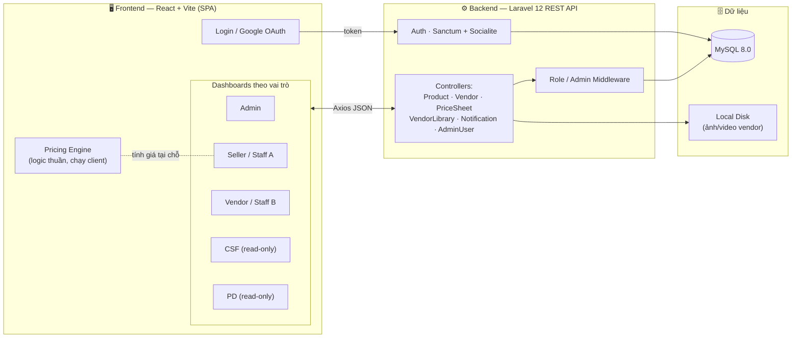
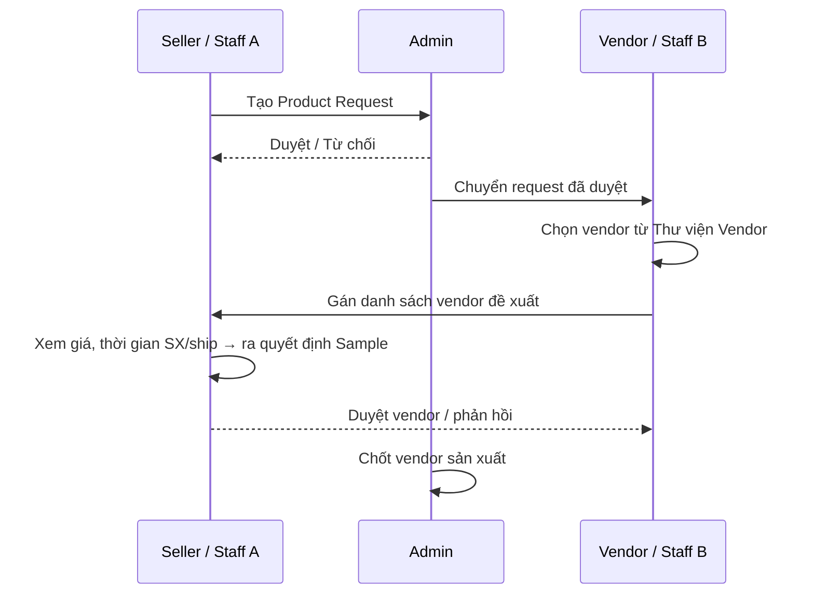
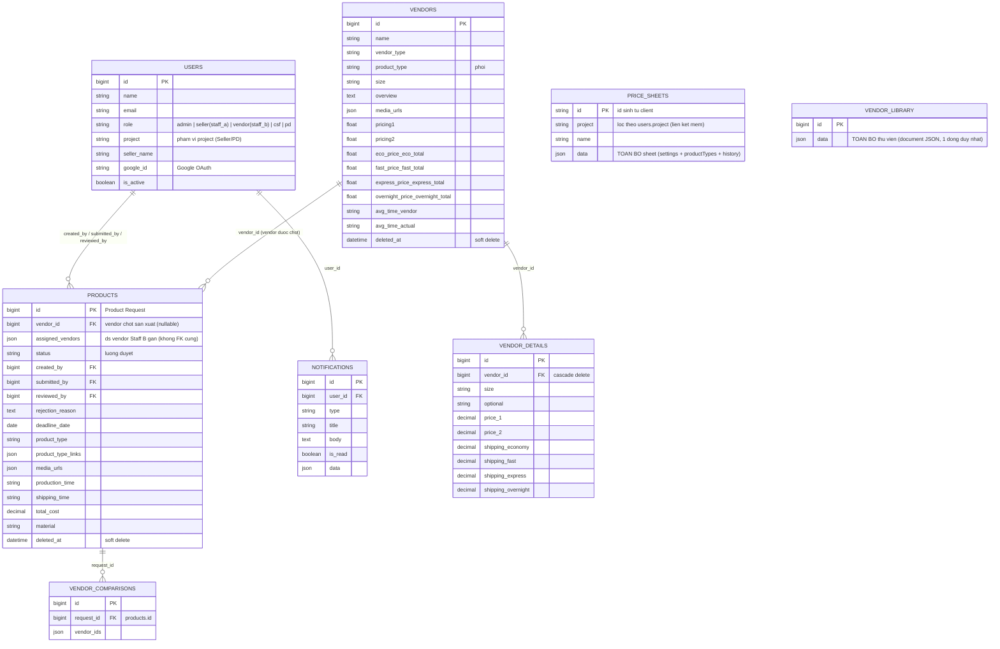

# HappyC-Hub Vendor Manager

Hệ thống nội bộ **số hoá quy trình quản lý nhà cung cấp (Vendor) và thẩm định giá sản phẩm** cho **Happy Creative LLC** 

Production: [vendorhub.viehana.com](https://vendorhub.viehana.com)

---

## 1. Mục tiêu dự án — Bài toán được giải quyết

Trước khi chốt đơn vị sản xuất cho một sản phẩm, team nội bộ phải trao đổi qua lại rất nhiều giữa các phòng ban: Sales đề xuất sản phẩm, Operations tìm và đề xuất vendor, Seller thẩm định cấu trúc giá, còn Admin duyệt. Trước đây quy trình này chạy rời rạc trên **Excel + Google Sheet**, dẫn tới:

- Bảng giá vendor mỗi người một bản, dễ lệch số, khó tra cứu lại.
- Công thức tính giá bán (giá vốn → phí Amazon → coupon → lợi nhuận/margin) làm thủ công trên Google Sheet, dễ sai và khó chia sẻ.
- Không rõ ai đang chờ ai duyệt; thông báo giữa các phòng ban dựa vào nhắc miệng.
- Bộ phận Chăm sóc khách hàng (CSF) và Thiết kế (PD) cần tra cứu thông tin vendor nhưng **không được phép thấy giá**.

**HappyC-Hub giải quyết các vấn đề trên bằng cách:**

| Vấn đề | Cách hệ thống giải quyết |
|---|---|
| Dữ liệu vendor phân mảnh | **Thư viện Vendor** tập trung, import trực tiếp từ file Excel chuẩn Happy Creative. |
| Tính giá thủ công, dễ sai | **Pricing Engine** số hoá toàn bộ công thức sheet (xem mục 5), tái sử dụng cho workspace + export. |
| Quy trình duyệt mù mờ | Luồng **Request → Assign Vendor → Duyệt** rõ ràng theo vai trò, kèm thông báo cross-role. |
| Lộ giá cho bộ phận không phận sự | Vai trò **CSF/PD read-only**, ẩn hoàn toàn mọi trường giá ở tầng UI. |
| Tra cứu chậm | Xem nhanh ảnh, chất liệu, thời gian SX/ship, size trong một modal gọn. |

---

## 2. Sơ đồ hệ thống (System Overview)



**Kiến trúc tổng thể:** SPA React (build tĩnh) gọi REST API Laravel qua Axios; xác thực bằng token (Sanctum) hoặc Google OAuth (Socialite); dữ liệu lưu ở MySQL, media (ảnh/video vendor) lưu ở đĩa local qua symlink. Logic tính giá chạy **hoàn toàn phía client** để phản hồi tức thời khi seller chỉnh số.

---

## 3. Vai trò & Luồng nghiệp vụ (Roles & Workflow)

Hệ thống có 5 vai trò — 3 vai trò tham gia luồng duyệt và 2 vai trò chỉ-xem:

| Vai trò | Nhiệm vụ |
|---|---|
| **Admin** | Duyệt/từ chối Product Request, quản lý nhân sự & phân quyền, xem toàn bộ dữ liệu. |
| **Seller / Staff A** | Tạo yêu cầu sản phẩm (Product Request), duyệt vendor do Staff B đề xuất, **thiết lập giá bán**. |
| **Vendor / Staff B** | Tiếp nhận Request, quản lý Thư viện Vendor (import Excel), gán vendor phù hợp cho từng sản phẩm. |
| **CSF** *(Customer Service & Fulfillment)* | **Read-only** Thư viện Vendor, **ẩn giá**. Xem được cả 4 project cùng lúc. |
| **PD** *(Product Design)* | **Read-only** Thư viện Vendor, **ẩn giá**. Chỉ xem project được phân quyền. |

### Luồng duyệt sản phẩm



> **Ẩn giá cho CSF/PD:** Hai vai trò này dùng chung dữ liệu Thư viện Vendor nhưng mọi trường giá (Target Cost, Economy/Express/Overnight Price, Total Price…) bị **lọc bỏ trước khi render/truyền props** — không lộ trong markup hay response hiển thị. CSF xem đa-project (hiện 4 project); PD chỉ xem project hiện tại.

---

## 4. Tính năng chính

- **Quản lý Product Request** — Staff A tạo yêu cầu, Admin duyệt, Staff B tiếp nhận và xử lý.
- **Thư viện Vendor** — Import danh sách vendor từ file Excel (định dạng Happy Creative), lưu thông tin phôi, size và bảng giá theo từng project.
- **Gán Vendor cho sản phẩm** — Staff B gán vendor phù hợp; Seller xem và ra quyết định đặt Sample.
- **Bảng tính giá của Seller (Price Sheet)** — số hoá sheet tính giá, xem chi tiết ở mục 5.
- **Tra cứu read-only cho CSF/PD** — xem Thư viện Vendor không kèm giá, đúng phạm vi project.
- **Thông báo cross-role** — Admin → Staff B, Staff B → Staff A, Seller → Staff B (mock qua localStorage + polling; backend có `notifications`).
- **Xuất Excel** — export danh sách sản phẩm và bảng giá.
- **Media vendor** — upload ảnh/video, lightbox xem nhanh.

---

## 5. Phần tính giá (Pricing Engine)

Trái tim nghiệp vụ của hệ thống. File [`frontend/src/utils/pricingEngine.js`](frontend/src/utils/pricingEngine.js) là **logic thuần, không dính React**, được tái sử dụng cho workspace tính giá, danh sách bảng giá và export Excel.

### Mô hình dữ liệu một bảng tính giá

```
sheet
 ├─ settings (Price Setting)  → price, quantity, ship/order, ship/item,
 │                              coupon($/%), variableFee%, amzFee%, importTax
 └─ productTypes[]            → mỗi Product Type (Phôi) chọn từ Thư viện Vendor
      ├─ customizeInfos[]     → các khoản customize seller tự thêm (tuỳ ý)
      └─ sizes[]              → mỗi size: sizeAdd, itemCost (giá vốn), customize{}
```

`+ Thêm Product Type` **chọn từ Thư viện Vendor bằng picker** (không gõ tay) → tự nạp size và Item Cost theo phương thức ship (Economy / Ground / Express / 2 Days / Overnight).

### Công thức (khớp 1:1 với sheet gốc)

Với mỗi dòng **size**, đặt `qty = Quantity` (để trống hoặc ≤ 0 → coi như **1**, đảm bảo tương thích ngược):

```
Unit Price   = Price + Phôi + Giá Size + Σ Customize Info        (giá 1 sản phẩm, chưa ship)
Total Price  = Unit Price × qty + Shipping                       (multipack: nhân trước, cộng ship sau)
AMZ Fee      = AMZ% × Total Price
Coupon       = Coupon$ + Coupon% × Total Price
Variable Fee = Variable% × Coupon                                (= 0 khi coupon = 0)
Total Cost   = Item Cost × qty + Shipping + ImportTax            (vốn hàng ×qty; ship & thuế cộng 1 lần)

Profit       = Total Price − AMZ Fee − Total Cost                          (trước khuyến mãi)
Profit (KM)  = Total Price − AMZ Fee − Variable Fee − Coupon − Total Cost  (sau khuyến mãi)
Margin       = Profit / Total Price
```

**Điểm cần lưu ý:**
- **Quantity (multipack):** mô phỏng listing bán nhiều sản phẩm/1 đơn. Ship và ImportTax cộng **một lần/đơn** (bám đúng công thức `$C$7` cộng ngoài phần `×Quantity` trong sheet gốc), không nhân theo qty.
- Để trống Quantity ⇒ mọi bảng cũ giữ **nguyên số** như trước.
- `Item Cost` (giá vốn) là input tường minh trong app — trong sheet gốc nó bị ẩn.

Lưu server, chia sẻ theo project qua API `/api/price-sheets` (xem mục 7).

---

## 6. System Architecture — Tech Stack & Cấu trúc

### Frontend
- **Framework:** React 19 + Vite (SPA) · **Routing:** React Router DOM v7 (route theo vai trò).
- **UI:** phần lớn tự code Box/Modal/Table bằng inline CSS theo Design System nội bộ (`HC.orange`, `HC.surface`, gradient, glassmorphism — [`src/constants/sellerTheme.js`](frontend/src/constants/sellerTheme.js)); có dùng Chart.js cho biểu đồ. Hạn chế UI framework.
- **State:** React `useState/useEffect` + **`localStorage`** làm mock DB / mô phỏng notification real-time giữa các tab-role.
- **HTTP:** Axios ([`src/services/api.js`](frontend/src/services/api.js)) · **Excel:** SheetJS (XLSX).

### Backend
- **Framework:** Laravel 12 — REST API.
- **Auth:** Laravel Sanctum (token) + Laravel Socialite (Google OAuth), phân quyền qua `RoleMiddleware` / `AdminMiddleware`.
- **Database:** MySQL 8.0 · **Storage:** đĩa local (symlink `storage:link`).

### Phân lớp Backend

```
Route (api.php)
  → Middleware (auth:sanctum · role · admin)
    → Controller (Product / Vendor / PriceSheet / VendorLibrary / Notification / AdminUser)
      → Model (Eloquent: Product · Vendor · User · Notification)
        → MySQL
```

### Cấu trúc thư mục

```
/
├── backend/                 # Laravel 12 API
│   ├── app/Http/Controllers # Product, Vendor, PriceSheet, VendorLibrary, Notification, AdminUser…
│   ├── app/Models           # Product, Vendor, User, Notification
│   ├── app/Http/Middleware  # RoleMiddleware, AdminMiddleware
│   ├── database/migrations  # Schema (products, vendors, vendor_details, users, notifications…)
│   └── routes/api.php        # Khai báo toàn bộ endpoint
├── frontend/                # React + Vite
│   ├── src/pages            # Login, Admin/Seller/Vendor/Csf/Pd Dashboard
│   ├── src/components        # UI theo vai trò (admin/ seller/ vendor/ csfpd/ shared)
│   ├── src/utils            # pricingEngine, vendorLibraryIndex, vendorExcel, productExcel
│   ├── src/services         # api.js (Axios)
│   └── dist/                # ⚠️ Build tĩnh đã commit — thứ THỰC SỰ chạy ở production
├── .htaccess                # Rewrite rule cho hosting
└── docker-compose.yml       # MySQL & phpMyAdmin (dev local)
```

---

## 7. API chính (REST)

Base: `/api` · phần lớn nằm sau `auth:sanctum`.

| Nhóm | Endpoint tiêu biểu |
|---|---|
| **Auth** | `POST /login`, `POST /logout`, `GET /me`, `GET /auth/google/redirect·callback` |
| **Products** | `GET·POST /products`, `GET·PUT·DELETE /products/{id}`, `POST /products/{id}/submit`, `POST /products/{id}/assign-vendors` |
| **Duyệt (Admin)** | `GET /admin/product-approvals`, `POST /admin/products/{id}/approve·reject`, `GET /admin/products/{id}/vendor-comparison` |
| **Vendors** | `GET·POST /vendors`, `GET·PUT·DELETE /vendors/{id}`, `POST /vendors/import`, `GET /vendors/compare` |
| **Vendor Library** | `GET·POST /vendor-library`, `POST /vendor-library/sample-status·upload-images·restore-backup` |
| **Price Sheets** | `GET /price-sheets`, `POST /price-sheets`, `DELETE /price-sheets/{id}` |
| **Notifications** | `GET /notifications`, `POST /notifications/read-all`, `POST /notifications/{id}/read` |
| **Nhân sự (Admin)** | `GET·POST /admin/users`, `PATCH /admin/users/{id}`, `PATCH /admin/users/{id}/status` |

---

## 8. Data Model / ERD



**Ghi chú thiết kế:**

- **2 kiểu lưu trữ song song:** các bảng nghiệp vụ (`products`, `vendors`, `vendor_details`…) là quan hệ chuẩn; riêng **`price_sheets`** và **`vendor_library`** hoạt động như **document store** — toàn bộ nội dung nằm trong cột JSON `data`, backend chỉ đọc/ghi blob (riêng `sample-status` được server sửa đúng 1 field để tránh client ghi đè lẫn nhau).
- **Phân quyền theo project ở tầng dữ liệu:** `price_sheets.project` khớp chuỗi với `users.project` (liên kết mềm, không FK). `PriceSheetController` lọc **ngay tại server** — role thường chỉ nhận sheet thuộc project của mình, không lộ giá project khác; admin/vendor(staff_b) thấy tất cả.
- **`products.assigned_vendors`** là JSON array (không FK cứng) — danh sách vendor Staff B đề xuất; còn `products.vendor_id` là vendor **được chốt** cuối cùng.
- **Soft delete** trên `products` và `vendors` (`deleted_at`) — xoá không mất lịch sử.
- Migrations còn các bảng `customers`, `orders`, `order_items`, `payments`, `inventory_logs` từ scaffold ban đầu — **không dùng** trong luồng nghiệp vụ hiện tại (legacy).

