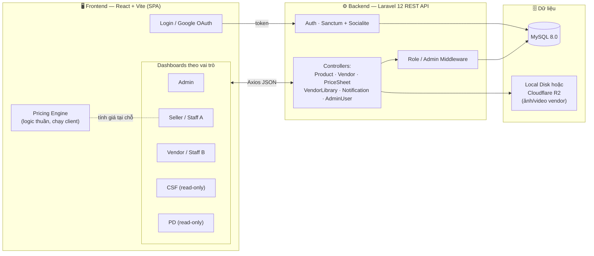
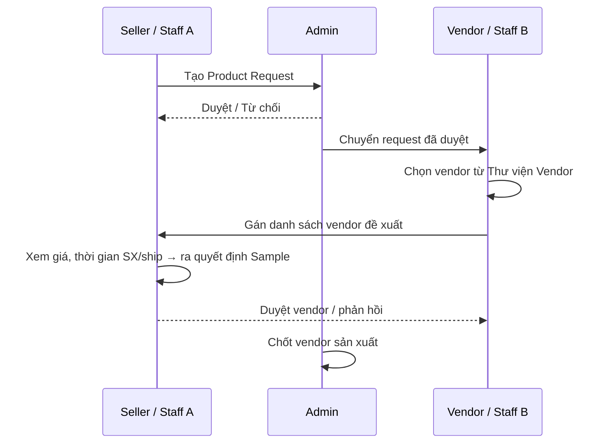
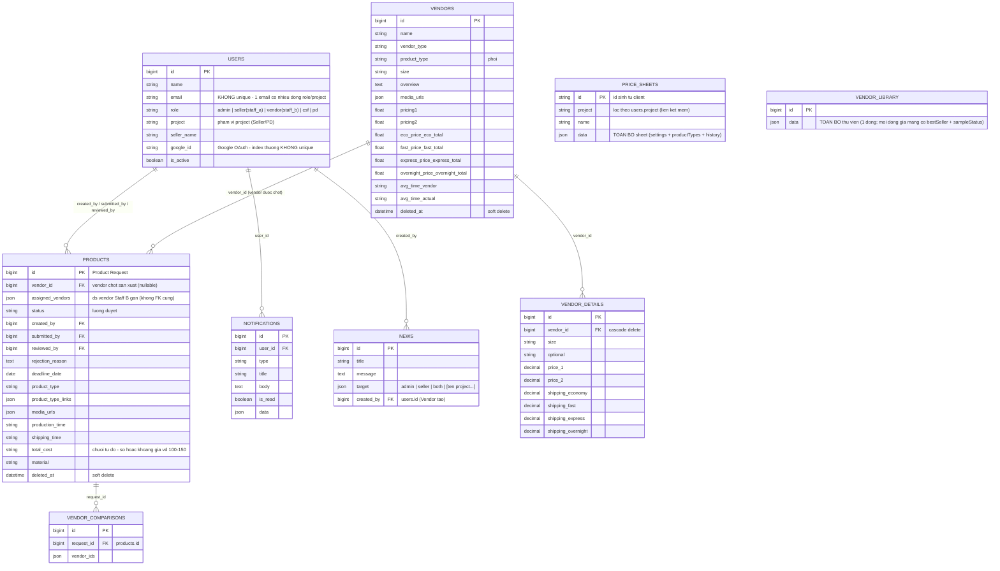
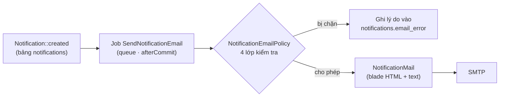

# HappyC-Hub Vendor Management

Hệ thống nội bộ **số hoá quy trình quản lý nhà cung cấp (Vendor) và thẩm định giá sản phẩm** cho **Happy Creative** 

Production: [vendorhub.viehana.com](https://vendorhub.viehana.com)

---

## 1. Mục tiêu dự án — Bài toán được giải quyết

Trước khi chốt đơn vị sản xuất cho một sản phẩm, team nội bộ phải trao đổi qua lại rất nhiều giữa các phòng ban: Sales đề xuất sản phẩm, Operations tìm và đề xuất vendor, Seller thẩm định cấu trúc giá, còn Admin duyệt. Trước đây quy trình này chạy rời rạc trên **Excel + Google Sheet**, dẫn tới:

- Bảng giá vendor mỗi người một bản, dễ lệch số, khó tra cứu lại.
- Công thức tính giá bán (giá vốn → phí Amazon → coupon → lợi nhuận/margin) làm thủ công trên Google Sheet, dễ sai và khó chia sẻ.
- Không rõ ai đang chờ ai duyệt; thông báo giữa các phòng ban dựa vào nhắc miệng.
- Bộ phận Chăm sóc khách hàng (CSF) và Thiết kế (PD) cần tra cứu thông tin vendor nhưng **không được phép thấy giá**.

**HappyC-Hub giải quyết các vấn đề trên bằng cách:**

| Vấn đề | Cách hệ thống giải quyết |
|---|---|
| Dữ liệu vendor phân mảnh | **Thư viện Vendor** tập trung, import trực tiếp từ file Excel chuẩn Happy Creative. |
| Tính giá thủ công, dễ sai | **Pricing Engine** số hoá toàn bộ công thức sheet (xem mục 5), tái sử dụng cho workspace + export. |
| Quy trình duyệt mù mờ | Luồng **Request → Assign Vendor → Duyệt** rõ ràng theo vai trò, kèm thông báo cross-role. |
| Lộ giá cho bộ phận không phận sự | Vai trò **CSF/PD read-only**, ẩn hoàn toàn mọi trường giá ở tầng UI. |
| Tra cứu chậm | Xem nhanh ảnh, chất liệu, thời gian SX/ship, size trong một modal gọn. |

---

## 2. Sơ đồ hệ thống (System Overview)



**Kiến trúc tổng thể:** SPA React (build tĩnh) gọi REST API Laravel qua Axios; xác thực bằng token (Sanctum) hoặc Google OAuth (Socialite); dữ liệu lưu ở MySQL, media (ảnh/video vendor) lưu ở đĩa local qua symlink. Logic tính giá chạy **hoàn toàn phía client** để phản hồi tức thời khi seller chỉnh số.

---

## 3. Vai trò & Luồng nghiệp vụ (Roles & Workflow)

Hệ thống có 6 vai trò — 3 vai trò tham gia luồng duyệt và 3 vai trò chỉ-xem:

| Vai trò | Nhiệm vụ |
|---|---|
| **Admin** | Duyệt/từ chối Product Request, quản lý nhân sự & phân quyền, xem toàn bộ dữ liệu. |
| **Seller / Staff A** | Tạo yêu cầu sản phẩm (Product Request), duyệt vendor do Staff B đề xuất, **thiết lập giá bán**. |
| **Vendor / Staff B** | Tiếp nhận Request, quản lý Thư viện Vendor (import Excel), gán vendor phù hợp cho từng sản phẩm. |
| **CSF** *(Customer Service & Fulfillment)* | **Read-only** Thư viện Vendor, **ẩn giá**. Sidebar cố định **4 project**: Happy · Creative · Global · Hapify84. |
| **PD** *(Product Design)* | **Read-only** Thư viện Vendor, **ẩn giá**. Sidebar liệt kê **đúng các project được phân công cho email này** — một PD có thể phụ trách nhiều project. |
| **Marvel** | **Read-only** Thư viện Vendor, **ẩn giá** — quyền giống hệt CSF (phục vụ mọi project), chỉ khác tên vai trò và đường dẫn dashboard (/marvel). |

### Một email — nhiều vai trò / nhiều project

Cùng một người có thể giữ nhiều vai trò, hoặc cùng vai trò ở nhiều project. Mô hình dữ liệu: **mỗi (email + role + project) là một dòng riêng trong `users`** — vì vậy `users.email` **không unique**.

Hệ quả ở đăng nhập:

- Nếu email chỉ khớp một tài khoản → vào thẳng.
- Nếu khớp nhiều tài khoản **khác vai trò** → hiện **bước chọn tài khoản** (`POST /api/select-account`). Vé chọn tài khoản được mã hoá bằng `APP_KEY`, hết hạn sau 10 phút.
- Nếu khớp nhiều tài khoản **cùng vai trò, khác project** (vd PD làm 2 project) → vào thẳng, sidebar tự liệt kê đủ project.

`GET /api/me` trả thêm trường `projects` — danh sách mọi project của email này ở cùng vai trò — để UI dựng sidebar.

### Luồng duyệt sản phẩm



> **Ẩn giá cho CSF/PD:** Hai vai trò này dùng chung dữ liệu Thư viện Vendor nhưng mọi trường giá (Target Cost, Economy/Express/Overnight Price, Total Price…) bị **lọc bỏ trước khi render/truyền props** — không lộ trong markup hay response hiển thị. Khác nhau ở phạm vi: CSF luôn thấy đủ 4 project (danh sách cứng ở client); PD chỉ thấy các project được cấp tài khoản.

---

## 4. Tính năng chính

- **Quản lý Product Request** — Staff A tạo yêu cầu, Admin duyệt, Staff B tiếp nhận và xử lý. Trường **Total Cost** nhận **khoảng giá** dạng tự do (`100-150`), không chỉ một con số — vì Seller gộp Base + Shipping nên thường ra khoảng. Các trường mô tả dài (Vùng In, Packaging, Đặc tính KT, Review) hiển thị trong ô cố định chiều cao có cuộn, tránh form dài vô tận.
- **Thư viện Vendor** — Import danh sách vendor từ file Excel (định dạng Happy Creative), lưu thông tin phôi, size, bảng giá và **ghi chú (Notes)** theo từng project. Ba tab: **Tổng quan Vendor & Sản phẩm**, **New Arrivals**, **Best Seller**.
- **New Arrivals** — file upload mới hiển thị ở tab riêng kèm badge **"Mới"** trong **tuần** được upload (tuần tính từ **thứ Hai**); sang thứ Hai tuần kế tiếp tự trở về "Tổng quan" như file thường, không cần thao tác tay.
- **Best Seller** — Vendor đánh dấu ⭐ dòng sản phẩm nổi bật; **lưu ở DB** (không còn localStorage) nên Seller/CSF/PD trên mọi thiết bị đều thấy giống nhau.
- **Sửa nhanh tại chỗ** — trong bảng giá của Thư viện Vendor, Vendor sửa được các ô **giá** và **Product Type / Size / Optional** bằng click-để-sửa; Seller/CSF/PD chỉ xem.
- **Gán Vendor cho sản phẩm** — Staff B gán vendor phù hợp (kèm thời gian SX/ship do chính vendor báo); Seller xem và ra quyết định đặt Sample.
- **Bảng tính giá của Seller (Price Sheet)** — số hoá sheet tính giá, xem chi tiết ở mục 5.
- **Quản Lý Thông Báo (News)** — Vendor đăng tin/thông báo cho Admin & Seller; **lưu ở DB** (bảng `news`), không mất khi F5 hay đổi máy.
- **Tra cứu read-only cho CSF/PD** — xem Thư viện Vendor không kèm giá, đúng phạm vi project.
- **Thông báo cross-role** — chuông thông báo nhắc việc giữa các vai trò (Admin ↔ Staff B ↔ Staff A) theo từng bước của luồng duyệt.
- **Mirror thông báo qua email** — mọi thông báo đáng chú ý trên chuông được gửi song song vào hộp thư của đúng người nhận, chạy nền qua hàng đợi. Chi tiết ở mục 9.
- **Xuất Excel** — export danh sách sản phẩm và bảng giá.
- **Media vendor** — upload ảnh/video, lightbox xem nhanh.

---

## 5. Phần tính giá (Pricing Engine)

Trái tim nghiệp vụ của hệ thống. File [`frontend/src/utils/pricingEngine.js`](frontend/src/utils/pricingEngine.js) là **logic thuần, không dính React**, được tái sử dụng cho workspace tính giá, danh sách bảng giá và export Excel.

### Mô hình dữ liệu một bảng tính giá

```
sheet
 ├─ settings (Price Setting)  → price, quantity, ship/order, ship/item,
 │                              coupon($/%), variableFee%, amzFee%, importTax
 └─ productTypes[]            → mỗi Product Type (Phôi) chọn từ Thư viện Vendor
      ├─ customizeInfos[]     → các khoản customize seller tự thêm (tuỳ ý)
      └─ sizes[]              → mỗi size: sizeAdd, itemCost (giá vốn), customize{}
```

`+ Thêm Product Type` **chọn từ Thư viện Vendor bằng picker** (không gõ tay) → tự nạp size và Item Cost theo phương thức ship (Economy / Ground / Express / 2 Days / Overnight). Picker **gộp các vendor trùng** (collapse duplicate), hiển thị kèm thông tin phôi và **nhãn so sánh (compare label)** để chọn đúng vendor giữa nhiều lựa chọn tương đương.

Bảng size hỗ trợ **copy/paste theo cột** cho Item Cost và các Customize Info (dán nhanh một dải giá trị xuống nhiều dòng), đã bỏ cột "Bộ tổng hợp" cũ.

### Công thức (khớp 1:1 với sheet gốc)

Với mỗi dòng **size**, đặt `qty = Quantity` (để trống hoặc ≤ 0 → coi như **1**, đảm bảo tương thích ngược):

```
Unit Price   = Price + Phôi + Giá Size + Σ Customize Info             (giá 1 sản phẩm, chưa ship)
Total Price  = (Unit Price + Ship/Item) × qty + Ship/Order
Coupon       = Coupon$ + Coupon% × ((Unit Price + Ship/Item) × qty)   ← % chỉ áp trên phần hàng, không gồm Ship/Order
AMZ Fee      = AMZ% × (Total Price − Coupon)
Variable Fee = Variable% × (Unit Price × qty − Coupon)
Total Cost   = (Item Cost + ImportTax) + (qty − 1) × (P1 + Ship cost/item + ImportTax)          ← dòng lấy từ Thư viện Vendor
Total Cost   = (Item Cost + Ship/Item + ImportTax) × qty + (Ship/Order − Ship/Item)             ← dòng nhập tay

Profit       = Total Price − AMZ Fee − Total Cost                          (trước khuyến mãi)
Profit (KM)  = Total Price − AMZ Fee − Variable Fee − Coupon − Total Cost  (sau khuyến mãi)
Margin       = Profit / Total Price
```

Giá vốn của dòng lấy từ **Thư viện Vendor** (bản chỉnh 2026-09):
- **Item Cost** ← cột **Total (Fulfill)** của Ship Method đang áp dụng — giá vốn **đã gồm ship**, nên không cộng thêm Price Ship. Với qty = 1: `Total Cost = Item Cost + ImportTax`.
- **Ship Method tự nhận diện** theo cột Total (Fulfill) có dữ liệu (ô trống / $0 coi như không có giá):
  - chỉ 1 phương thức có giá → tự áp, hiện chip `✓ Economy`, Seller không phải bấm;
  - 2+ phương thức → chỉ cho chọn trong số có giá (kèm khoảng giá trên nút); chưa chọn thì Item Cost trống, Profit/Margin hiện "—";
  - phương thức đã lưu không còn giá → còn 1 thì tự chuyển (badge "Đã chuyển X → Y"), còn 2+ thì bắt chọn lại;
  - không có Total ở đâu → Item Cost tạm dùng **P1** kèm cảnh báo "chưa gồm ship".
- Size không có Total ở phương thức đang áp dụng → ô "Thiếu giá", **không** tự lấy giá của phương thức khác; size đó không tính vào Avg margin.
- Multipack: sản phẩm đầu tính trọn Total (Fulfill), mỗi sản phẩm thêm tính **P1 + Price Ship Item 2**.
- Bảng giá có sẵn: mở ra là Item Cost hiện theo Total (Fulfill) tương ứng; với qty = 1 mọi con số tiền giữ nguyên (P1 + Price Ship = Total). Không có migration, không tự ghi server khi chưa sửa gì.
- Ship phía chi phí (từ thư viện) tách biệt với **Ship/Item & Ship/Order** ở Price Setting — hai cái sau chỉ dùng cho **Total Price** (doanh thu). Product Type nhập tay dùng tạm Price Setting làm cost-ship.


**Điểm cần lưu ý:**
- **Cột "Profit" hiển thị = lãi SAU khuyến mãi** (Profit KM = đã trừ Variable Fee + Coupon) ở **cả bảng tính lẫn file Excel export**. Cột **Margin** vẫn tính theo lãi trước KM; cột **After Promo** theo lãi sau KM.
- **Quantity (multipack):** mô phỏng listing bán nhiều sản phẩm/1 đơn. Để trống ⇒ qty = 1; khi qty = 1 và không có coupon, Total Price / Total Cost / Profit **giữ nguyên số** như bản cũ.
- **Variable Fee ≠ 0 kể cả khi coupon = 0** (tính theo `Variable% × Unit × qty`) — nên "After Promo" luôn thấp hơn Margin một chút.
- `Item Cost` (giá vốn) là input tường minh trong app — trong sheet gốc nó bị ẩn.

Lưu server, chia sẻ theo project qua API `/api/price-sheets` (xem mục 7).

---

## 6. System Architecture — Tech Stack & Cấu trúc

### Frontend
- **Framework:** React 19 + Vite (SPA) · **Routing:** React Router DOM v7 (route theo vai trò).
- **UI:** phần lớn tự code Box/Modal/Table bằng inline CSS theo Design System nội bộ (`HC.orange`, `HC.surface`, gradient, glassmorphism — [`src/constants/sellerTheme.js`](frontend/src/constants/sellerTheme.js)); có dùng Chart.js cho biểu đồ. Hạn chế UI framework.
- **State:** React `useState/useEffect` + **`localStorage`** để chia sẻ state giữa các tab và giữa các vai trò.
- **HTTP:** Axios ([`src/services/api.js`](frontend/src/services/api.js)) · **Excel:** SheetJS (XLSX).

### Backend
- **Framework:** Laravel 12 — REST API.
- **Auth:** Laravel Sanctum (token) + Laravel Socialite (Google OAuth), phân quyền qua `RoleMiddleware` / `AdminMiddleware`.
- **Database:** MySQL 8.0 · **Storage:** đĩa local (symlink `storage:link`) hoặc **Cloudflare R2** (S3-compatible, qua `FILESYSTEM_DISK=s3` + `AWS_*` env trỏ endpoint R2).

### Phân lớp Backend

```
Route (api.php)
  → Middleware (auth:sanctum · role · admin)
    → Controller (Product / Vendor / PriceSheet / VendorLibrary / Notification / AdminUser)
      → Model (Eloquent: Product · Vendor · User · Notification)
        → MySQL
```

### Cấu trúc thư mục

```
/
├── backend/                 # Laravel 12 API
│   ├── app/Http/Controllers # Product, Vendor, PriceSheet, VendorLibrary, News, Notification, AdminUser…
│   ├── app/Models           # Product, Vendor, User, Notification, News
│   ├── app/Http/Middleware  # RoleMiddleware, AdminMiddleware
│   ├── database/migrations  # Schema (products, vendors, vendor_details, users, notifications, news…)
│   └── routes/api.php        # Khai báo toàn bộ endpoint
├── frontend/                # React + Vite
│   ├── src/pages            # Login, Admin/Seller/Vendor/Csf/Pd Dashboard
│   ├── src/components        # UI theo vai trò (admin/ seller/ vendor/ csfpd/ shared)
│   ├── src/utils            # pricingEngine, vendorLibraryIndex, vendorExcel, productExcel
│   ├── src/services         # api.js (Axios)
│   └── dist/                # ⚠️ Build tĩnh đã commit — thứ THỰC SỰ chạy ở production
├── .htaccess                # Rewrite rule cho hosting
└── docker-compose.yml       # MySQL & phpMyAdmin (dev local)
```

---

## 7. API chính (REST)

Base: `/api` · phần lớn nằm sau `auth:sanctum`.

| Nhóm | Endpoint tiêu biểu |
|---|---|
| **Auth** | `POST /login`, `POST /select-account`, `POST /logout`, `GET /me`, `GET /auth/google/redirect·callback` |
| **Products** | `GET·POST /products`, `GET·PUT·DELETE /products/{id}`, `POST /products/{id}/submit`, `POST /products/{id}/assign-vendors` |
| **Duyệt (Admin)** | `GET /admin/product-approvals`, `POST /admin/products/{id}/approve·reject`, `GET /admin/products/{id}/vendor-comparison` |
| **Vendors** | `GET·POST /vendors`, `GET·PUT·DELETE /vendors/{id}`, `POST /vendors/import`, `GET /vendors/compare` |
| **Vendor Library** | `GET·POST /vendor-library`, `POST /vendor-library/sample-status·best-seller·upload-images·restore-backup` |
| **Price Sheets** | `GET /price-sheets`, `POST /price-sheets`, `DELETE /price-sheets/{id}` |
| **News (Thông báo)** | `GET·POST /news`, `PUT·DELETE /news/{id}`, `POST /news/{id}/send` |
| **Notifications** | `GET /notifications`, `POST /notifications/read-all`, `POST /notifications/{id}/read` |
| **Nhân sự (Admin)** | `GET·POST /admin/users`, `PATCH /admin/users/{id}`, `PATCH /admin/users/{id}/status` |

---

## 8. Data Model / ERD



**Ghi chú thiết kế:**

- **2 kiểu lưu trữ song song:** các bảng nghiệp vụ (`products`, `vendors`, `vendor_details`, `news`…) là quan hệ chuẩn; riêng **`price_sheets`** và **`vendor_library`** hoạt động như **document store** — toàn bộ nội dung nằm trong cột JSON `data`, backend chỉ đọc/ghi blob. Riêng **`sample-status`** và **`best-seller`** được server sửa **đúng 1 field** trong blob (không nhận cả blob từ client) để tránh nhiều thiết bị ghi đè lẫn nhau.
- **Phân quyền theo project ở tầng dữ liệu:** `price_sheets.project` khớp chuỗi với `users.project` (liên kết mềm, không FK). `PriceSheetController` lọc **ngay tại server** — role thường chỉ nhận sheet thuộc project của mình, không lộ giá project khác; admin/vendor(staff_b) thấy tất cả.
- **`products.assigned_vendors`** là JSON array (không FK cứng) — danh sách vendor Staff B đề xuất; còn `products.vendor_id` là vendor **được chốt** cuối cùng.
- **Soft delete** trên `products` và `vendors` (`deleted_at`) — xoá không mất lịch sử.
- **Danh tính không unique theo email:** vì một người có thể giữ nhiều vai trò/project, `users.email` và `users.google_id` **đều không còn ràng buộc UNIQUE** (chỉ còn index thường). Tính hợp lệ được đảm bảo ở tầng ứng dụng: `SocialAuthController` chỉ gắn `google_id` cho các dòng **cùng email đã được Google xác minh**.
- **`products.total_cost` là chuỗi, không phải số** — nó chứa khoảng giá do Seller nhập (`100-150`). Mọi chỗ so sánh với giá vendor phải đi qua [`frontend/src/utils/targetCost.js`](frontend/src/utils/targetCost.js) (lấy cận trên của khoảng làm trần), **không dùng `Number()` trực tiếp** vì `Number("100-150")` = `NaN`.
- Migrations còn các bảng `customers`, `orders`, `order_items`, `payments`, `inventory_logs` từ scaffold ban đầu — **không dùng** trong luồng nghiệp vụ hiện tại (legacy).

---

## 9. Mirror thông báo qua Email

Chuông trong app chỉ thấy được khi người ta đang mở app. Nhiều bước trong luồng duyệt lại là **chờ người khác** (Admin chờ request mới, Seller chờ vendor được gán, Vendor chờ yêu cầu cung cấp vendor) — nên mỗi `Notification` đáng chú ý được **mirror sang email**, chạy nền qua hàng đợi, không chặn request nghiệp vụ.

### Luồng gửi



### Bốn lớp kiểm tra trước khi gửi

Toàn bộ quyết định nằm ở [`app/Services/NotificationEmailPolicy.php`](backend/app/Services/NotificationEmailPolicy.php), theo thứ tự:

1. **Người nhận hợp lệ** — user còn tồn tại, `is_active`, email đúng định dạng.
2. **Role allow-list cứng** — khai báo ở [`config/notification_mail.php`](backend/config/notification_mail.php). Role không nằm trong danh sách của loại đó **không bao giờ** nhận mail, bất kể cài đặt nói gì.
3. **Ma trận cài đặt** — bảng `notification_email_settings` (`role` × `type` × `enabled`), seed sẵn ngay trong migration, để Admin bật/tắt được mà không cần deploy code.
4. **Chống trùng & trần số lượng** — cùng một thông báo không gửi lại trong **5 phút** (riêng `library_updated` là **15 phút**); trần `MAIL_HOURLY_CAP` mail/giờ (mặc định 300, đặt 0 để bỏ giới hạn) bảo vệ quota SMTP.

### Các loại được gửi mail

| Loại (`type`) | Người nhận | Nội dung |
|---|---|---|
| `new_form` | Admin | Có Product Request mới cần duyệt |
| `approved` / `rejected` | Seller | Request được duyệt / bị từ chối (kèm lý do) |
| `needs_vendor` | Vendor | Request cần cung cấp vendor |
| `deadline_updated` | Seller | Deadline của request thay đổi |
| `vendor_assigned` | Seller | Staff B đã gán vendor đề xuất |
| `library_updated` | Admin · Vendor · Seller · PD · CSF · Marvel | Thư viện Vendor có file/dòng giá thay đổi — Seller/PD chỉ nhận nếu file thuộc project của mình (lọc ở [`VendorLibraryDiff`](backend/app/Support/VendorLibraryDiff.php)) |

> Các loại `news`, `feedback`, `pending` **cố ý không có trong config** nên chỉ chạy trên chuông web, không gửi mail.

### Thêm một loại mail mới

Sửa **đúng một chỗ**: thêm khoá vào `types` trong `config/notification_mail.php` (icon, label, nút bấm, `roles` được phép, các trường `meta` hiển thị), thêm route đích ở `routes`, rồi thêm dòng `(role, type)` vào migration của `notification_email_settings`. Không rải điều kiện ra các controller.

### Biến môi trường liên quan

```env
QUEUE_CONNECTION=database      # job gửi mail chạy nền; cần chạy queue worker
FRONTEND_URL=https://vendorhub.viehana.com   # ghép thành link nút bấm trong mail

MAIL_MAILER=smtp
MAIL_HOST=
MAIL_PORT=587
MAIL_USERNAME=
MAIL_PASSWORD=
MAIL_ENCRYPTION=tls
MAIL_FROM_ADDRESS=
MAIL_FROM_NAME="HappyC Hub"
MAIL_HOURLY_CAP=300            # trần mail/giờ, 0 = không giới hạn
```

Với `QUEUE_CONNECTION=database`, production phải có worker chạy thường trực (`php artisan queue:work`, nên bọc bằng supervisor/systemd) — nếu không, job nằm mãi trong bảng `jobs` và **không có mail nào được gửi**.

---

## 10. Cài đặt & chạy local

**Yêu cầu:** PHP ≥ 8.2 · Composer · Node.js ≥ 18 · MySQL 8.0 (hoặc dùng `docker-compose.yml` kèm sẵn).

### Backend (Laravel 12)

```bash
cd backend
composer install
cp .env.example .env          # điền DB_*, FRONTEND_URL, MAIL_*, (tuỳ chọn) AWS_* cho R2
php artisan key:generate
php artisan migrate
php artisan storage:link      # symlink cho ảnh/video vendor
php artisan serve             # http://127.0.0.1:8000
php artisan queue:work        # cửa sổ riêng — bắt buộc nếu muốn nhận email
```

### Frontend (React 19 + Vite)

```bash
cd frontend
npm install
npm run dev                   # http://localhost:5173
npm run test                  # Vitest
npm run lint
```

### Database bằng Docker (tuỳ chọn)

```bash
docker compose up -d          # MySQL 8.0 + phpMyAdmin
```

### Chạy test backend

```bash
cd backend
php artisan test              # gồm test phân quyền giá, rò rỉ giá CSF/PD, policy email
```

---

## 11. Build & Deploy — ⚠️ Đọc trước khi sửa frontend

Repo **commit cả thư mục build `frontend/dist/`**, và production serve **trực tiếp bundle đã commit** (deploy thủ công: SSH vào VPS, `git pull`, serve `dist/` — **không rebuild trên server**). Hệ quả:

1. **Sửa source frontend ⇒ BẮT BUỘC rebuild:**
   ```bash
   cd frontend && npx vite build
   ```
   rồi commit **cả `src/` lẫn `dist/`**. Chỉ commit source mà quên rebuild ⇒ production chạy code cũ.

2. **Push git KHÔNG tự deploy.** Sau khi merge vào `main` phải redeploy thủ công (pull + serve lại `dist/`); bundle có thể trùng tên hash nên đảm bảo file mới **đè** file cũ.

3. **Đổi schema ⇒ chạy `php artisan migrate` trên production.** Dự án không chạy `db:seed` ở production — dữ liệu khởi tạo bắt buộc phải seed ngay trong migration.

### ⛔ Tuyệt đối không resolve conflict thủ công trong `frontend/dist/`

`dist/assets/index-*.js` là **JS đã minify**. Resolve tay (giữ cả hai bên, hoặc sót marker `<<<<<<<` / `=======` / `>>>>>>>`) sẽ làm hỏng cú pháp bundle ⇒ **React không mount ⇒ trắng trang toàn bộ app**. Đây là sự cố có thật (16/07/2026): bundle lỗi SyntaxError: Identifier 'Of' has already been declared.

**Cách xử lý đúng:** bỏ qua nội dung conflict của bundle, chạy lại `npx vite build` để **tái tạo** `dist/` từ source đã resolve, rồi `git add -A frontend/dist`.

### Kiểm chứng bundle trước khi deploy

```bash
cd frontend && npx vite preview
```
Mở bằng trình duyệt (hoặc Chrome headless) và kiểm tra `#root` có render (`childElementCount > 0`) và console không có exception — bắt lỗi trắng trang **trước** khi lên production.

### Quy ước Git

- Nhánh tính năng đặt theo tiền tố `feat/`, `fix/`, `chore/`, `docs/`; commit theo Conventional Commits (`feat(pricesheet): …`).
- Mỗi thay đổi đi qua PR vào `main`, squash-merge.
- **Đóng bớt PR trùng đang mở** — nhiều PR cùng nhánh sẽ đẩy bản `dist/` cũ lên `main` và gây conflict lặp lại ở bundle; mỗi lần resolve là một lần rủi ro hỏng bundle như sự cố ở trên.

### Những thứ KHÔNG commit

`node_modules/` (mọi cấp), file `.env` thật (chỉ commit `.env*.example`), log, file tạm của editor/AI agent — xem [`.gitignore`](.gitignore) ở thư mục gốc và `.gitignore` riêng của `backend/`, `frontend/`.

> Ngoại lệ có chủ đích: `frontend/dist/` và `backend/vendor/` **được commit** vì production deploy thủ công bằng `git pull`, không chạy build/`composer install` trên server.
