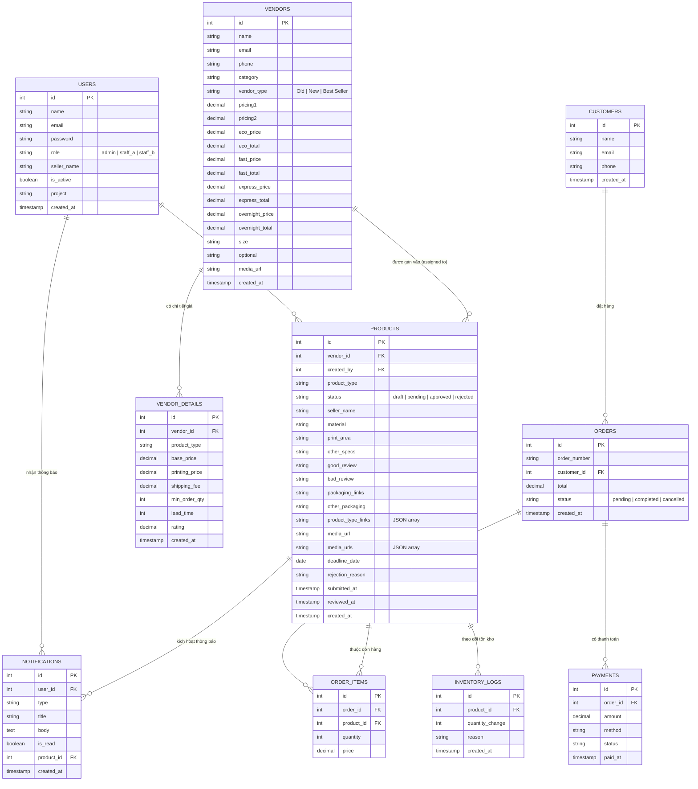

# Sơ đồ Quan hệ Database — TechStore Hub

## Entity Relationship Diagram (ERD)



---

## Tóm tắt quan hệ chính

| Quan hệ | Mô tả |
|---|---|
| `Users` → `Products` | **1-N** — Mỗi Staff A (Kinh doanh) tạo nhiều Phôi yêu cầu |
| `Vendors` → `Products` | **1-N** — Một Vendor được gán cho nhiều Phôi (bởi Staff B) |
| `Vendors` → `Vendor_Details` | **1-N** — Mỗi Vendor có nhiều bảng giá theo từng loại sản phẩm |
| `Users` → `Notifications` | **1-N** — Mỗi User nhận nhiều thông báo |
| `Products` → `Notifications` | **1-N** — Một Phôi khi thay đổi trạng thái sẽ tạo ra thông báo |
| `Customers` → `Orders` | **1-N** — Mỗi khách hàng có nhiều đơn hàng |
| `Orders` → `Order_Items` | **1-N** — Mỗi đơn hàng có nhiều dòng sản phẩm |
| `Orders` → `Payments` | **1-1** — Mỗi đơn hàng có một lần thanh toán |

---

## Luồng dữ liệu theo vai trò (Data Flow by Role)

```
Staff A (Kinh doanh)
    └─ Tạo PRODUCT (status: draft)
    └─ Gửi duyệt → PRODUCT (status: pending)

Admin (Quản trị)
    └─ Xem PRODUCT pending
    └─ Duyệt → PRODUCT (status: approved)  → tạo NOTIFICATION cho Staff A
    └─ Từ chối → PRODUCT (status: rejected) → tạo NOTIFICATION cho Staff A

Staff B (Vận hành)
    └─ Xem PRODUCT approved
    └─ Tìm VENDOR phù hợp → gán VENDOR_ID vào PRODUCT
    └─ So sánh giá qua VENDOR_DETAILS (Price Matrix)
    └─ Gửi NOTIFICATION cho Staff A về kết quả

Staff A (Kinh doanh)
    └─ Nhận NOTIFICATION từ Staff B
    └─ Xác nhận / Từ chối Vendor
```
